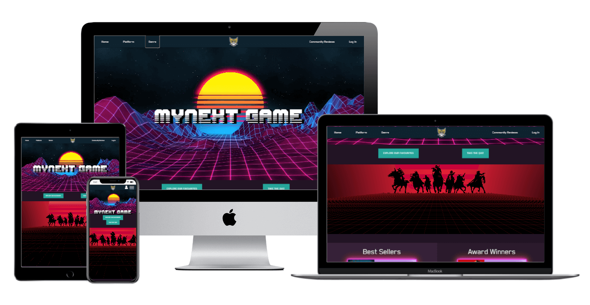
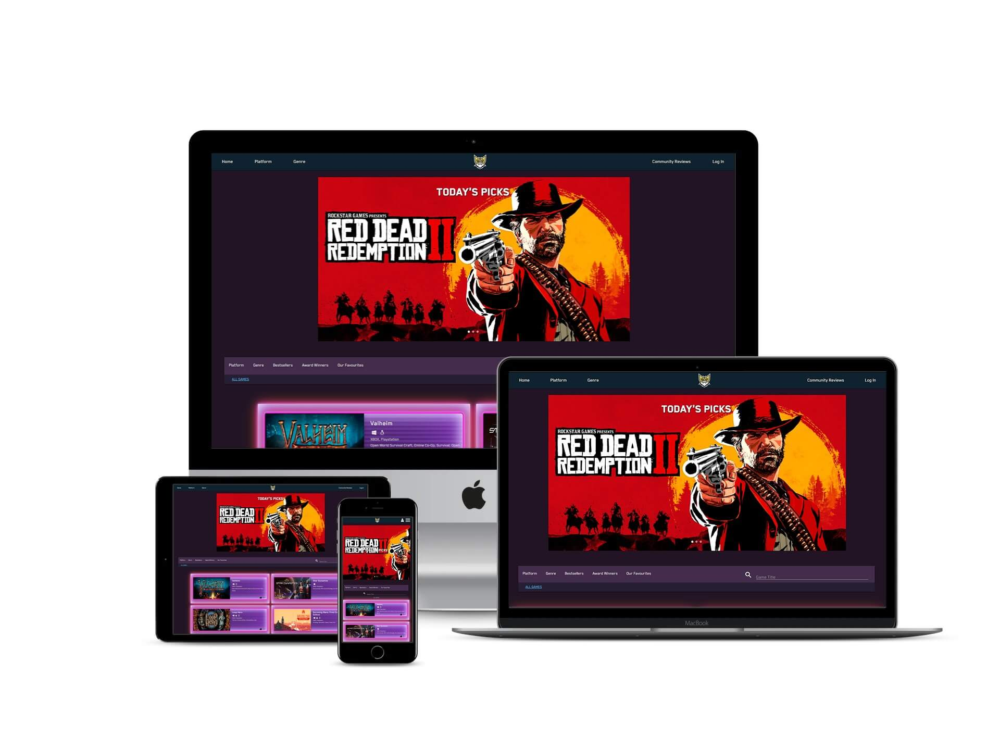

# my Next Game

**my Next Game** is an aspiring community-based platform for gamers. By registering an account, users can submit game reviews, like on games, and customize their profiles and game playlists. Reviews are free from commercial bias and give gamers the freedom and resources to submit their real thoughts and opinons about a huge variety of games. **my Next Game** strives to be unique, and is specifically tailored for the user, creating the potential for this web-application to form into a platform that is honest and free.

| .      | .     |
| ------- | ------ |
|  | 

-----

## Contents 

- [Project Purpose](#project-purpose)

- [User Stories](#user-stories)

- [Design](#design)

    - [Typography](#typography)

    - [Wireframes](#wireframes)

- [Implemented Features](#implemented-features)

    - [List of Pages](#list-of-pages)

- [Technologies Used](#technologies-used)

    - [Languages](#languages)

    - [Frameworks, Libraries and Programs](#frameworks-libraries-and-programs)

- [Credits](#credits)

    - [Code](#code)

        - [Web Scraping](#web-scraping)

        - [Python and Flask](#python-and-flask)

        - [Site Features](#site-features)

-----

## Project Purpose 

The primary aim of this website is to help gamers decide which game they should play next. The website aims to establish a gaming community platform where users can read and submit game reviews, create their own profiles, customise game playlists and reach out to other members of the community.

### Project Goals

The most siginficant goal of this web application is to ensure that the expectations of the target audience is met. The web application must offer a wide selection of games for users to browse through, and sort those games into relevant categories to make the navigation of the site easy and intuitive. It is also important to include C-R-U-D functionality to site that meets user expectations and follows the overarching schema of the project.

### Project Owner Goals

The primary goal is to establish a community platform that would have the potential to grow and thrive as a real-world application. It is imperative that the application has a high-quality layout and UX design, meets acccessibility guidelines, prioritizes its information appropriately and handles the back-end intuitively. 

### Target Audience 

The target audience is gamers, coming from a wide range of platforms and backgrounds. However, the site is more catered to PC gamers as the game data that is used in the web application derives from a PC video game distrubtion service: Steam. Also, a majority of the games present on the site have an age rating that is only suitable for late teenage years and above.

-----

## User Stories

### First Time User Goals

- As a first time user I want to immediately understand the purpose of the application.

- I want to be able to see an about page or an explanation to what this site is and what it can offer me. 

- I want to be able to find games easily.

- I want to be able to use a sort feature so that I only see the results I want.

- I want to be able to register on the site and make a user profile.

- I want to see reviews of games, and be able to search for particular game titles or genres of those reviews.

- I want to be able to vote on games that I like.

- I want to leave reviews of my own.

- If I don't know what I'm looking for, I want a site feature that will help me decide what game to play next.

- I want to see games that are recommended by the site.

- I want to add games to my personal games list.

### Returning User Goals

- As a returning user, I want to be able to customize my profile. I want to add a bio to my profile and upload a custom profile image.

- I want to be able to see all the reviews that I have made, and have the option to edit or delete them. 

- I want to update my games list. I want to categories games into what I am currently playing, what I have played and want I want to play in the future.

- I want to see profiles of other users.

- I want to find the site's contact information so that I can get help on an issue.

- I want to request new games to be added to the database.

- I want to add games to a favourites list.

-----

## Design

### Typography

The two fonts, and their variants, that are used throughout the site are [BlenderPro]() and [Cyberspace Raceway](). Both are clean and readable fonts that correlate well with the site's visual aesethic. [BlenderPro]() especially suited both the visual and contextually theme of the website, as it is same font used for the [Cyberpunk Website](), of which I took some visual inspiration from. Cyberpunk is a sci-fi game that was released in late 2020, and has both a sci-fi and synthwave theme running throughout the game. Many gamers who would would use this site may notice this visual reference, which makes the design choice more than suitable.

[BlenderPro]() comes a variety of font styles, including:

- BlenderPro-Bold

- BlenderPro-Book, which was used for the following:
    - The navlinks in the navbar
    - The navlinks in the secondary navbar for all of the Game pages
    - The majority of text content on the Homepage
    - Log In and Register page
    - The game titles within the game cards on all of the Game pages
    - The review verdict stickers on the Community Reviews page
    - The paragraph tags for the review cards on the Community Reviews page
    - Flash messages
    - Profile page (all text content)

- BlenderPro-BookItalic

- BlenderPro-Heavy
    - The carousel header
    - The game title for the review cards on the Community Reviews page
    - The collapsible header for the review cards on the Community Reviews page

- BlenderPro-Medium
    - The like button on the Game pages

- BlenderPro-MediumItalic

- BlenderPro-Thin
    - The card content of the game cards on all of the Games pages
    - The username and review date for the review cards on the Community Reviews page

- BlenderPro-ThinItalic

- [Cyberspace Raceway]() was only used for the site's title on the Homepage

-----

### Wireframes

I used [Balsamiq](https://balsamiq.com/) to construct the surface plane. After delving into writing the code for the application, some design alterations were made. This included using a separate page for the Log In and Register process rather than using a modal, which may have been obstructive on smaller and/or touchscreen devices.

Each page has a wireframe for both desktop and mobile devices. I did not include a tablet wireframe in the design phase because I wanted the site to look nearly identical on larger tablet and desktop devices. Particularly as many laptops now can also function as a touchscreen tablet, I thought it was important that there were no stark differences between the two as this may have compromised good UX design. Nevertheless, the mobile wireframe can represent tablet devices with smaller screens.

Each wireframe can be viewed via the links below:

- Homepage:
    - [Desktop](static/wireframes/homepage_1.png)
    - [Login, Register and Profile](static/wireframes/homepage_2.png)
    - [Mobile](static/wireframes/homepage_3.png)

- Game Page:
    - [Desktop and Mobile](static/wireframes/games_page.png)

- Favourites Page:
    - [Desktop and Mobile](static/wireframes/favourites_page.png)

- Reviews Page:
    - [Desktop and Mobile](static/wireframes/reviews_page.png)

- Profile Page:
    - [Profile Games List](static/wireframes/profile.png)
    - [Profile Games List Version 2](static/wireframes/profile_games_list.png)
    - [Profile Reviews](static/wireframes/profile_reviews.png)

- Site Navigation Mindmap:
    - [Site navigation mindmap](static/wireframes/navigation_mindmap.png)
    - [Site navbar navigation links](static/wireframes/navbar_mindmap.png)
    

-----

## Implemented Features

### List of Pages

**Note** This does not include an entire list of all the HTML files

- Homepage

- Game Pages
    - All Games 
    - Action
    - Adventure
    - RPG
    - Strategy
    - Multiplayer

- Favourites Page 

- Community Reviews

- Login page

- Register page

- Profile Page
    - Profile - Game List 
    - Profile - User Reviews
    - Edit Profile

-----

## Technologies Used

### Languages 

- HTML (5)
- CSS (3)
- Javascript
- Python 

### Frameworks, Libraries and Programs 

- [MongoDB](https://www.mongodb.com/)
    - MongoDB is a document database, which stores its data in JSON-like formats. It was used to store all the data for my web-application, which included data for games, reviews, avatars and details about users.

- [Heroku](https://www.heroku.com/)
    - Heroku is a platform service that enables developers to build, ruin and operate applications within its cloud server. It was used to deploy my web-application.

- [Materialize 1.0.0](https://getbootstrap.com/)
    - Materialize 1.0.0 is a modern responsive CSS framework based on Material Design by Google. It was used to help with the site's responsiveness, implement useful and intuitive features and provide a clean foundation for the website's design.

- [Flask](https://flask.palletsprojects.com/en/1.1.x/) 
    - Flask is a micro web framework which depends on the [Jinja Template](https://jinja.palletsprojects.com/en/2.11.x/) template engine and the [Werkzeug WSGI toolkit](https://werkzeug.palletsprojects.com/en/1.0.x/) WSGI toolkit. Flask allowed me to implement url routing, template engine and many more frameworks to add extensive user interactivty to my site.

- [Jinja Template](https://jinja.palletsprojects.com/en/2.11.x/)
    - Jinja Template is a designer-friendly templating language for Python. It allowed me to build websites quickly, removed the need to repeat a lot of code and allowed me to incorporate the data that was pulled from [MongoDB](https://www.mongodb.com/) into the HTML files.

- [Werkzeug WSGI toolkit](https://werkzeug.palletsprojects.com/en/1.0.x/)
    - Werkzeug is a comprehensive WSGI web application library. I used it in my project to encrypt passwords generated by the user when logging in or registering an account, in order to uphold the security of the site.

- [PyMongo](https://pymongo.readthedocs.io/en/stable/)
    - PyMongo is Python module which contains tools for interacting with [MongoDB](https://www.mongodb.com/) database. I used to interact with my MongoDB database.

- [BeautifulSoup](https://www.crummy.com/software/BeautifulSoup/bs4/doc/)
    - BeautifulSoup is a Python library for pulling data out of HTML and XML files. I used it for searching and 'scraping' (downloading data to my own python files) data from the Steam Store website. To the best of my knowledge, I practiced ethical web scraping, and did not cross boundaries of the site. I limited the amount of data I would pull from the site at a given time in order to in order and requested data at a resonable rate, which did not impact the performance of the source website. This saved me a lot of time and allowed the scope of my project to grow immensely. 

- [Requests](https://requests.readthedocs.io/en/master/)
    - Requests is a HTTP library for Python. I used this with [Flask](https://flask.palletsprojects.com/en/1.1.x/) and [BeautifulSoup](https://www.crummy.com/software/BeautifulSoup/bs4/doc/) in order to scrape data from the Steam Store webpage, which is where I got the majority of data for my site.
  
- [JQuery 3.5.1](https://jquery.com/)
    - JQuery 3.5.1 was used to initialize certian features within the [Materialize 1.0.0](https://getbootstrap.com/) framework. It was also used to write custom JS code.

- [Jquery UI](https://jqueryui.com/)
    - Jquery UI is a widget and iteraction library built on top of [JQuery 3.5.1](https://jquery.com/) It was used to implements features that were not present within the [Materialize 1.0.0](https://getbootstrap.com/) framework. I used JQuery UI to implement an autocomplete function that was customizable in way that Materialize autocomplete was not.

- [Jquery UI Themes](https://jqueryui.com/themeroller/)
    - Jquery UI Themes is a CSS framework that adds design to the [Jquery UI](https://jqueryui.com/) features. I used JQuery Themes to help style the JQuery UI autocomplete function.

- [Jquery UI Download Builder](https://jqueryui.com/download/)
    - Jquery UI Download Builder allows you to pick what you want from the [Jquery UI](https://jqueryui.com/) library and then download that as a custom JQuery UI JS fike. This allowed me to use the JQuery UI autocomplete function while ensuring not to conflict with any of the [Materialize 1.0.0](https://getbootstrap.com/) components.

- [Google Fonts](https://fonts.google.com/)
    -Google Fonts was used to add visual variety to the typography and help maintain a visual theme.

- [Font Awesome 5.14](https://fontawesome.com/)
  - Font Awesome 5.14 was for adding icons or image cues to the project to employ a good UX design.
  
- [Visual Studio Code](https://code.visualstudio.com/)
  - Visual Studio Code was the software used to write the code. 
  
- [Git](https://git-scm.com/)
  - Git was used for version control by utilising the GitBash terminal in Visual Studio Code to commit to Git and push to [GitHub](https://github.com/).
  
- [GitHub](https://github.com/)
  - GitHub is used to store the project's code after being pushed to Git. It acts as a cloud-based service to store the project’s assets and code. My GitHub account was linked to [Heroku](https://www.heroku.com/) to trigger automatic deployment of my web-application.

- [Smartmockups - Free Product Mockup Generator](https://smartmockups.com/)
  - Smartmockups is a web-application that allows you to create free mockup images. I used it in this readme file to present a mockup image of the project.

- [Techsini - Multi Device Website Mockup Generator](https://techsini.com/multi-mockup/index.php)
  - Techsini is a web-application that allows you to create free mockup images. I used it in this readme file to present a mockup image of the project.

- [Responsively App](https://responsively.app/)
  - Responsively App is DevTool software that allows you to see an instant preview of all target screens for your website in a single window, side-by-side. It was used to check the responsiveness of my site.

- [Asana](https://app.asana.com/0/home/1192103038725952)
  - Asana is a web and mobile application designed to help you organise, track and manage your projects. It was used to organise my project and schedule each task efficiently.

-----

## Credits

### Code

#### Web Scraping

- For help with splitting elements with BeautifulSoup, I looked to [this source](https://stackoverflow.com/questions/12616912/split-an-element-with-beautifulsoup")

- I used [this source](https://stackoverflow.com/questions/43814754/python-beautifulsoup-how-to-get-href-attribute-of-a-element/43814994) to get the href tags with BeautifulSoup

- For help with looping through a list of URLs with BeautifulSoup, I looked to [this source](https://stackoverflow.com/questions/44823278/how-to-loop-through-a-list-of-urls-for-web-scraping-with-beautifulsoup)

- I looked to [this source](https://stackoverflow.com/questions/11941817/how-to-avoid-runtimeerror-dictionary-changed-size-during-iteration-error) in order to fix 'Runtime Error: dictionary changed size during iteration'

- To remove whitespace from the HTML parser results, I based my code my code of [this source](https://stackoverflow.com/questions/53424179/beautifulsoup-stripping-whitespace)

- To bypass a the Steam Store's age check that will trigger on certain game pages, I used [this source](https://stackoverflow.com/questions/33603416/python-beautiful-soup-getting-past-steams-age-check)

- [This source](https://moonbooks.org/Articles/How-to-remove-string-control-characters-n-t-r-in-python/) helped me find a way to remove string control characters from parser results.

- [This source](https://runestone.academy/runestone/books/published/fopp/Sequences/SplitandJoin.html) helped with the join method for returning *only* the first few sentences of paragraph.

- A thank you to Jo and Scott from Code Institute for helping me with the code for replacing 'bundle' list items with game genre tags from the Steam Store bundle page.

#### Python and Flask

- The code for adding pagination functionality to my site was based upon [this source](https://gist.github.com/mozillazg/69fb40067ae6d80386e10e105e6803c9)

- For help finding all values of a particular within a MongoDB collection, I looked to [this source](https://stackoverflow.com/questions/34861949/how-to-find-all-values-for-a-specific-key-in-pymongo)

- To redirect users back to the same page, I looked to [this source](https://stackoverflow.com/questions/41270855/flask-redirect-to-same-page-after-form-submission/41272173) for aid

- I used [this source](https://stackoverflow.com/questions/2824157/random-record-from-mongodb) to help with returning a random document from the MongoDB collection

- Similarly, to select I random item from a list, I looked to [this source](https://stackoverflow.com/questions/306400/how-to-randomly-select-an-item-from-a-list)

- In order to get JQuery UI's autocomplete feature working, I needed a local JS file that held all the relevant data for it to link to. The code I used for exporting data from MongoDB to a local JS file was based upon [this source](https://stackoverflow.com/questions/60584148/export-pymongo-collection-to-a-json-file)

- I looked to [this source](https://stackoverflow.com/questions/11470614/mongodb-return-all-documents-by-field-without-duplicates) for finding out how to return all documents from MongoDB without duplicates

#### Site Features

- [Materialize](https://getbootstrap.com/) was used to implement a responsive layout and add interativity to the site. In particular, it has been used to construct the following features:
    - Mobile responsiveness through the use of its grid system
    - Responsive navbar with collapsible hamburger icon
    - The use of cards, implemented on multiple pages
    - Parallax effect on the Homepage and Our Favourites page
    - Carousel on the game pages
    - Modals
    - A tooltip which is triggered when trying to like a game when not logged into the site
    - Form structure, input field character count and form select
    - A collapsible which is used for showing and hiding the content of game reviews on the Community Reviews page and Profile - Reviews page

- I looked to [this source](https://stackoverflow.com/questions/36581504/materialize-carousel-slider-autoplay) for initiating autoplay on the Materialize carousel

- To trigger the Materialize tooltip on mouse-clicker, rather than the default hover, I looked to [this source](https://stackoverflow.com/questions/42524435/materialize-css-tooltip-shows-only-when-onclick)

- I used [this source](https://stackoverflow.com/questions/43896410/parallax-from-materialize-no-showing-image/43963949) to fix an issue I had with the Materialize parallax image not showing

- [JQuery UI](https://jqueryui.com/) was used to implement an automcomplete search feature, which I could not get working with [Materialize](https://getbootstrap.com/)

- To prevent users from entering and then submiting game titles that were not present within the database, I used [this source](https://stackoverflow.com/questions/2909077/autocomplete-disallow-free-text-entry) in order to disable any input that did not match what was available within the database.

- For styling the input words and dropdown focus for JQuery's autocomplete search feature, I used [this source](https://www.encodedna.com/jquery/how-to-highlight-input-words-using-jqueryui-autocomplete-widget.htm) and also [this source](https://www.encodedna.com/2013/08/jquery-autocomplete-dropdown-list-on-focus.htm) - both of which are from the same author

- I looked to [this source](https://stackoverflow.com/questions/40404375/materialize-css-remove-disabled-input-field-not-working) for help with disabling the Edit Profile input fields by default, which only allows users to use the input fields once its edit button is clicked

- The code for my custom sidenav is based upon [this source](https://www.w3schools.com/cssref/pr_class_display.asp)

- The hamburger icon is based upon [this source](https://codepen.io/designcouch/pen/Atyop)

- The glow effect used on the game cards are based upon [this source](https://codersblock.com/blog/creating-glow-effects-with-css/)

- To get a box shadow on images, I used [this source](https://www.w3schools.com/css/css3_shadows_box.asp)

- The star rating radio buttons within the 'Leave a Review' form were based upon [this source](https://embed.plnkr.co/plunk/C42MBE)

- The stars' glow effect were based upon [this source](https://www.w3schools.com/howto/howto_css_glowing_text.asp)

- The 'Yes' and 'No' radio buttons within the 'Leave a Review' form were based upon [this source](https://markheath.net/post/customize-radio-button-css)

- For customising Materialize's collapsible feature, I looked to [this source](https://stackoverflow.com/questions/45869545/how-to-remove-the-border-of-a-collapsible-div-li-in-materialize-css) for help with removing the collapsible div's border.

- The bounce animation for the scroll-up button, implemented in the right-hand corner of the Our Favourites page, was based upon [this source](https://codepen.io/bisaillonyannick/pen/pvZeGg)

- I used [this source](https://stackoverflow.com/questions/43858134/how-to-add-conditional-css-class-based-on-python-if-statement) for help with assigning a class to a div element with Jinja
