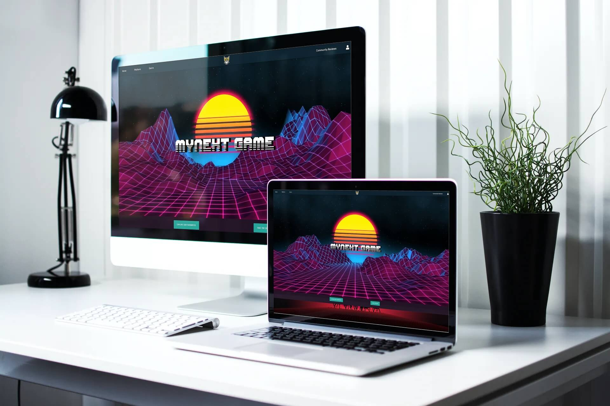
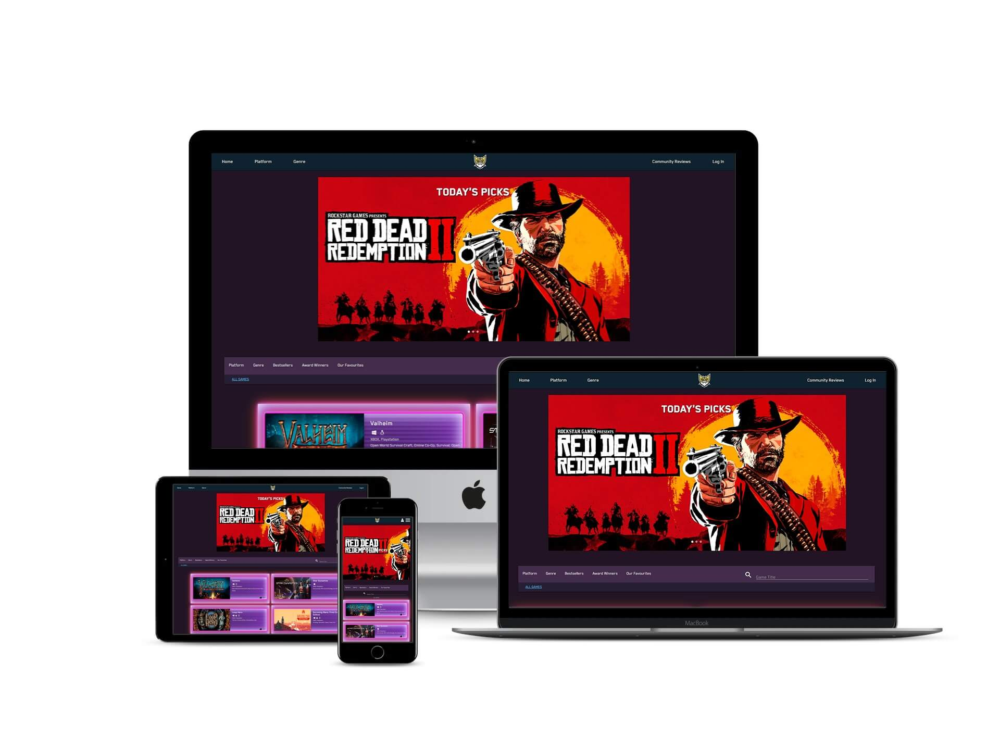

# my Next Game

**my Next Game** is an aspiring community-based platform for gamers. By registering an account, users can submit game reviews, like on games, and customize their profiles and game playlists. Reviews are free from commercial bias and give gamers the freedom and resources to submit their real thoughts and opinons about a huge variety of games. **my Next Game** strives to be unique, and is specifically tailored for the user, creating the potential for this web-application to form into a platform that is honest and free.

| .      | .     |
| ------- | ------ |
|  | 

-----

## Contents 

- [Project Purpose](#project-purpose)

- [User Stories](#user-stories)

- [Design](#design)

    - [Wireframes](#wireframes)

-----

## Project Purpose 

The primary aim of this website is to help gamers decide which game they should play next. The website aims to establish a gaming community platform where users can read and submit game reviews, create their own profiles, customise game playlists and reach out to other members of the community.

### Project Goals

The most siginficant goal of this web application is to ensure that the expectations of the target audience is met. The web application must offer a wide selection of games for users to browse through, and sort those games into relevant categories to make the navigation of the site easy and intuitive. It is also important to include C-R-U-D functionality to site that meets user expectations and follows the overarching schema of the project.

### Project Owner Goals

The primary goal is to establish a community platform that would have the potential to grow and thrive as a real-world application. It is imperative that the application has a high-quality layout and UX design, meets acccessibility guidelines, prioritizes its information appropriately and handles the back-end intuitively. 

### Target Audience 

The target audience is gamers, coming from a wide range of platforms and backgrounds. However, the site is more catered to PC gamers as the game data that is used in the web application derives from a PC video game distrubtion service: Steam. Also, a majority of the games present on the site have an age rating that is only suitable for late teenage years and above.

-----

## User Stories

### First Time User Goals

- As a first time user I want to immediately understand the purpose of the application.

- I want to be able to see an about page or an explanation to what this site is and what it can offer me. 

- I want to be able to find games easily.

- I want to be able to use a sort feature so that I only see the results I want.

- I want to be able to register on the site and make a user profile.

- I want to see reviews of games, and be able to search for particular game titles or genres of those reviews.

- I want to be able to vote on games that I like.

- I want to leave reviews of my own.

- If I don't know what I'm looking for, I want a site feature that will help me decide what game to play next.

- I want to see games that are recommended by the site.

- I want to add games to my personal games list.

### Returning User Goals

- As a returning user, I want to be able to customize my profile. I want to add a bio to my profile and upload a custom profile image.

- I want to be able to see all the reviews that I have made, and have the option to edit or delete them. 

- I want to update my games list. I want to categories games into what I am currently playing, what I have played and want I want to play in the future.

- I want to see profiles of other users.

- I want to find the site's contact information so that I can get help on an issue.

- I want to request new games to be added to the database.

- I want to add games to a favourites list.

-----

## Design

-----

### Wireframes

I used [Balsamiq](https://balsamiq.com/) to construct the surface plane. After delving into writing the code for the application, some design alterations were made. This included using a separate page for the Log In and Register process rather than using a modal, which may have been obstructive on smaller and/or touchscreen devices.

Each page has a wireframe for both desktop and mobile devices. I did not include a tablet wireframe in the design phase because I wanted the site to look nearly identical on larger tablet and desktop devices. Particularly as many laptops now can also function as a touchscreen tablet, I thought it was important that there were no stark differences between the two as this may have compromised good UX design. Nevertheless, the mobile wireframe can represent tablet devices with smaller screens.

Each wireframe can be viewed via the links below:

- Homepage:
    - [Desktop](static/wireframes/homepage_1.png)
    - [Log In, Register and Profile](static/wireframes/homepage_2.png)
    - [Mobile](static/wireframes/homepage_3.png)

- Game Page:
    - [Desktop and Mobile](static/wireframes/games_page.png)

- Favourites Page:
    - [Desktop and Mobile](static/wireframes/favourites_page.png)

- Reviews Page:
    - [Desktop and Mobile](static/wireframes/reviews_page.png)

- Profile Page:
    - [Profile Games List](static/wireframes/profile.png)
    - [Profile Games List Version 2](static/wireframes/profile_games_list.png)
    - [Profile Reviews](static/wireframes/profile_reviews.png)

- Site Navigation Mindmap:
    - [Site navigation mindmap](static/wireframes/navigation_mindmap.png)
    - [Site navbar navigation links](static/wireframes/navbar_mindmap.png)
    
