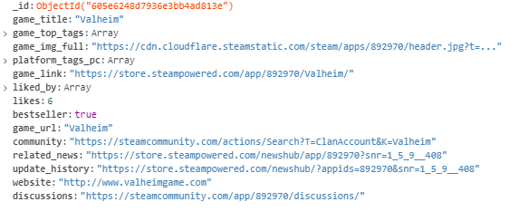
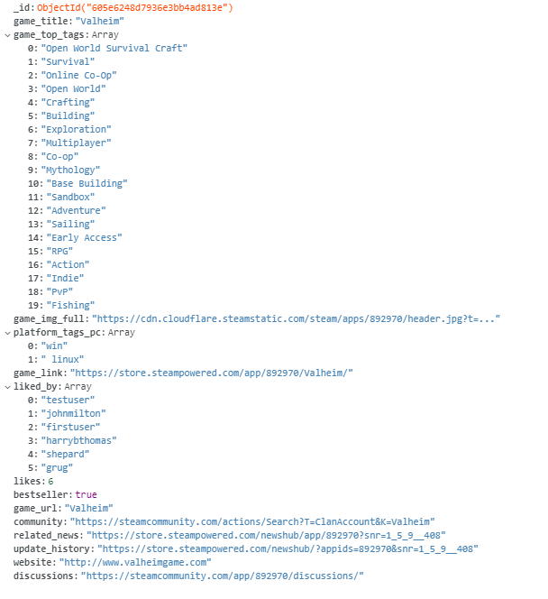

# my Next Game

**my Next Game** is an aspiring community-based platform for gamers. By registering an account, users can submit game reviews, like on games, and customize their profiles and game playlists. Reviews are free from commercial bias and give gamers the freedom and resources to submit their real thoughts and opinons about a huge variety of games. **my Next Game** strives to be unique, and is specifically tailored for the user, creating the potential for this web-application to form into a platform that is honest and free.


| .      | .     |
| ------- | ------ |
|  | 

-----

## Contents 

- [UX](#ux)

    - [Strategy Plane](#strategy-plane)

    - [User Stories](#user-stories)

    - [Scope Plane](#scope-plane)

    - [Structure Plane](#structure-plane)

        - [List of Pages](#list-of-pages)

        - [Site Navigation](#site-navigation)

        - [Existing Features](#existing-features)

            - [Navbar](#navbar)

            - [Homepage](#homepage)

            - [Our Favourites Page](#our-favourites-page)

            - [Games Pages](#games-pages)

            - [Community Reviews Page](#community-reviews-page)

            - [Visit Profiles](#visit-profiles)

            - [Visit Profiles - Likes](#visit-profiles---likes)

            - [Visit Profiles - Reviews](#visit-profiles---reviews)

            - [Log In Page](#log-in-page)

            - [Register Page](#register-page)

            - [Profile Page](#profile-page)

            - [Profile Page - Likes](#profile-page---likes)

            - [Profile Page - Reviews](#profile-page---reviews)

            - [Edit Profile - General](#edit-profile---general)

            - [Edit Profile - Avatar](#edit-profile---avatar)

            - [Edit Profile - Password](#edit-profile---password)

            - [Request A Game](#request-a-game)

            - [Admin Controls](#admin-controls)

            - [Admin Controls - User Requests](#admin-controls---user-requests)

            - [Admin Controls - Game Queue](#admin-controls---game-queue)

            - [Admin Controls - Update DB](#admin-controls---update-db)

    
    - [Skeleton Plane](#skeleton-plane)

        - [Wireframes](#wireframes)

    - [Surface Plane](#surface-plane)

        - [Typography](#typography)

        - [Synthwave](#synthwave)

        - [Colour](#colour)

- [Database Schema](#database-schema)

    - [Database Structure - All PC Games](#all-pc-games)

    - [Database Structure - Users](#users)

    - [Database Structure - User Games](#user-games)

    - [Database Structure - User Reviews](#user-reviews)

    - [Database Structure - Avatars](#avatars)

    - [Database Structure - Game Requests](#game-requests)

    - [Database Structure - Admin Game Links](#admin-game-links)

    - [Database Relationships](#database-relationships)

- [Web Scraping](#web-scraping)

- [Technologies Used](#technologies-used)

    - [Languages](#languages)

    - [Frameworks, Libraries and Programs](#frameworks-libraries-and-programs)

- [Testing](#testing)

- [Deployment](#deployment)

    - [Local Deployment](#local-deployment)

        - [Requirements](#requirements)

        - [Virtual Environment (Optional)](#virtual-environment-optional)

        - [Clone From GitHub Pages](#clone-from-github-pages)

        - [Installing Requirements](#installing-requirements)

        - [Setting up the Environment Variables](#setting-up-the-environment-variables)

        - [Note on Visual Studio Code](#note-on-visual-studio-code)

    - [Deployment to Heroku](#deployment-to-heroku)

- [Credits](#credits)

    - [Code](#code)

        - [Web Scraping](#web-scraping)

        - [Python and Flask](#python-and-flask)

        - [Site Features](#site-features)

-----

## UX 

### Strategy Plane

#### Project Purpose 

The primary aim of this website is to help gamers decide which game they should play next. The website aims to establish a gaming community platform where users can read and submit game reviews, create their own profiles, customise game playlists and reach out to other members of the community.

#### Project Goals

The most siginficant goal of this web application is to ensure that the expectations of the target audience is met. The web application must offer a wide selection of games for users to browse through, and sort those games into relevant categories to make the navigation of the site easy and intuitive. It is also important to include C-R-U-D functionality to site that meets user expectations and follows the overarching schema of the project.

#### Site Owner Goals

The primary goal is to establish a community platform that would have the potential to grow and thrive as a real-world application. It is imperative that the application has a high-quality layout and UX design, meets acccessibility guidelines, prioritizes its information appropriately and handles the back-end intuitively. 

#### Target Audience 

The target audience is gamers, coming from a wide range of platforms and backgrounds. However, the site is more catered to PC gamers as the game data that is used in the web application derives from a PC video game distrubtion service: [Steam](https://store.steampowered.com/). Also, a majority of the games present on the site have an age rating that is only suitable for late teenage years and above.

-----

### User Stories

#### First Time User Goals

- As a first time user I want to immediately understand the purpose of the application.

- I want to be able to see an about page or an explanation to what this site is and what it can offer me. 

- I want to be able to find games easily.

- I want to be able to use a sort feature so that I only see the results I want.

- I want to be able to register on the site and make a user profile.

- I want to see reviews of games, and be able to search for particular game titles or genres of those reviews.

- I want to be able to vote on games that I like.

- I want to leave reviews of my own.

- I want to see games that are recommended by the site.

- I want to add games to my personal games list.


#### Returning User Goals

- As a returning user, I want to be able to customize my profile. I want to add a bio to my profile and upload a custom profile image.

- I want to be able to see all the reviews that I have made, and have the option to edit or delete them. 

- I want to update my games list. I want to categorise games into what I am currently playing, what I have played and want I want to play in the future.

- I want to see profiles of other users.

- I want to find the site's contact information.

- I want to request new games to be added to the database.

- I want to see all the games that I have liked.


-----


### Scope Plane


#### Functional Specifications and Requirements

- Good UX design that is repsonsive, user friendly and easy to navigate.

- Clear and accessible navigation options for the site. This can be in the form of a fixed navbar at the top of the page, which will allow users to navigate to any part of the site easily and efficiently.

- Data must be dynamic, and must be organised in a way that is intuitive and clear.

- The site should not restrict users who are not logged in. Games and reviews should be available for all users to view. Pages that should only be accessible to registered users should not be visible to users who are not logged in. 

- C-R-U-D functionality should give the users the freedom to do what they want with their content. The site should respect the user's decision to edit and/or delete any reviews that they make.

- User experience should be held at paramount. The site should be intuitive and enjoyable for the user.


-----


### Structure Plane


#### List of Pages

**Note** This does not include an entire list of all the HTML files

- Homepage

- Game Pages
    - All Games 
    - Action
    - Adventure
    - RPG
    - Strategy
    - Multiplayer

- Favourites Page 

- Community Reviews

- Login page

- Register page

- Profile Page
    - Profile - Game List 
    - Profile - User Reviews
    - Edit Profile


#### Site Navigation

Below is a diagram illustrating the site's navigation, older mockups of the site's navigation can be viewed [here](static/wireframes/navigation_mindmap.png) and [here](static/wireframes/navbar_mindmap.png)

- For users who are not logged in:


- For users who are logged in:


- For admin users:


- A full illustration of the site's navigation:


#### Existing Features


##### Navbar

- Fixed navbar 

    - Built using Materialize to implement responsive UX design that is cross-compatible on a wide range of devices.

    - Allows users to easily navigate the site.

    - Improves user experience by removing the need to scroll to the top of the page in order to navigate the site.

- Hamburger collapse menu

    - Built using Materialize.

    - Adds a side nav to access navigation links.

    - Improves user experience for touch screen devices.
    
    - Conform to web-design conventions. 

    - Limits the amount of real estate used on smaller screens, particuarly mobile devices.

- Dropdown menu for Genre, Profile and Admin Controls navlinks.

    - Implements a dropdown menu (for desktop devices) to reduce the amount of real estate on the page.

    - Gives the user greater control in regards to the navigation of the site.

    - For smaller screens and mobile devices the content in the dropdown is moved to the side nav, which is accessed via the hamburger icon.

- Brand Logo

    - The site's logo is implemented to the center of the navbar to help make the site recognisable to returning users.


##### Homepage

- Hero background video
    
    - A vibrant hero image (video tag) to immediately encourage a positive emotional response from the user
    
    - The design links to the site's Synthwave theme, thus providing visual clarity by promoting a reoccuring theme. For more details on this theme, see [here](#synthwave).

    - The moving video makes it seem that the user is moving towards something. This can represent a journey, which links well to the idea of building a new community platform, as something that is constantly growing.

    - The site's title, *My Next Game* is displayed clearly over the hero video.

- Parrallax effect

    - Adds visual depth to the site.

    - Links well to other web pages that use it - Favourites page.

    - Promotes the Synthwave visual theme by providing more media images that are consistent of the Synthwave style.

    - Stresses the importance that I have placed on good UX design.

- Navigation buttons

    - An 'Explore Favourites' and 'Explore Games' button to encourage users to explore the site's primary content.

- About Us

    - Explains the purpose of the site to the user.

    - Encourages users to Register and interactive with the site.

- Game Lists - Bestsellers and Awardwinners

    - It was important to display games on the Homepage to further convey the site's purpose.

    - Both of these cateogories contain a wide selection of games (it is not limited to certain genres) and thus is suitable for several tastes and preferences, which can be expected by the user.

    - The game cards are interactive. Users can click on them and navigate to reviews for the game. This can encourage users to register in order to make reviews of their own.


##### Our Favourites Page

- Parallax effect

    - Adds visual depth

    - A visually effective way to split up information and images on the site.

    - The images within the parallax are of screenshots from a game that is randomized each day.

    - The text in the firt parallax section includes the game title and a summary of the game. There is also a See Reviews button, which will navigate to reviews of that game by directing users to the Community Reviews page.

    - The text in the second parallax section includes a navigation button that leads to the Request A Game form page.

- Scroll to Top button

    - A bouncing floating button at the bottom right hand side of the screen.

    - The up arrow represents its function.

    - When clicked it will scroll back up to the top of the page.

- Sort Filter

    - This allows users to sort the display order of games.

    - Two select inputs are present ('Sort By' and 'Order') and a 'Filter Results' button which will sort the games depending on the options chosen once clicked.

    - A downside to this feature is the page refresh. When clicking 'Filter Results' the page will refresh and send users to the top of the page. See [here]() for more details.

- Game Cards

    - Below the Parallax effect and Sort Filter is a list of games, each displayed within a card.

    - The cards follow the same Synthwave visual theme that is consistent with the rest of the site.

    - Each card has an image for the game, its title, platforms that it can be played on, genre tags and a summary. Each card also includes a 'Recommended By Us' tag, a 'Like' button and a 'See Reviews' button, which will direct users to the Community Reviews page and filter the results for only that game.

    - When logged in, a pulsing add button will be present on each card. When clicked it will add the game to the user's game playlist in their Profile.

    - The cards are fully responsive and are designed in a way that is appropriate for a wide variety of screen sizes.


##### Games Pages

- Carousel 

    - Built using Materialize

    - By default, the carousel has a swipe feature that is user friendly for all touchscreen devices, particularly mobile devices. Left and right arrows were implemented to ensure that the carousel was also user friendly on desktop devices that do not have touchscreen functionality.

    - The carousel is present on all of the Games pages, this includes All Games, Action Games, Adventure Games, RPG Games, Strategy Games and Multiplayer Games.

    - The carousel contains three images of three diffrent games that are randomized upon refresh and/or first load of the page.

    - Below each image is the title and genre tags to match the game shown in the image.

- Secondary Navbar

    - Underneath the carousel is a secondary navbar containing navlinks that are appropirate for the filtering the game results below.

    - The following navlinks are:
        - Our Favourites
        - Award Winners
        - All Games
        - Genre
            - Action
            - Adventure
            - RPG
            - Strategy
            - Multiplayer

    - If the user is logged, then the 'Your List' navlink will be visible too.

    - A search bar is included to right, which allows users to search for specific game titles.

    - A collapsible hamburger icon will trigger on smaller devices.

- Sort Filter

    - This allows users to sort the display order of games.

    - Two select inputs are present ('Sort By' and 'Order') and a 'Filter Results' button which will sort the games depending on the options chosen once clicked.

    - 'Sort By' contains the following options:
        - Default
        - Title
        - Likes
        - Recommended
        - Award Winners
        - Bestsellers

    - 'Order' has 'desc' (descending) and 'asc' (ascending) options.

    - Sometimes the sort filter will cause games to occur multiple times when navigating through different pages. See [here]() for more details.

- Game Cards

    - Built with Materialize

    - The cards are horizontal from a width of 600px, anything below that then the content is displayed vertically.

    - The cards follow the same Synthwave visual theme that is consistent with the rest of the site.

    - Each card has an image for the game; its title, platforms that it can be played on, and genre tags. Each card also includes a 'Recommended By Us' tag if the game is included in the Favourites page (if it has the key/value pair of `favourite: True`). There is also a 'Like' button. Users must be logged in to leave likes on games.

    - If a user is not logged in while trying to leave a like, a tooltip will trigger above the like button asking them to log in or register an account in order to leave likes on games.

    - When logged in, a pulsing add button will be present on each card. When clicked it will add the game to the user's game playlist in their Profile.

    - The cards are fully responsive and are designed in a way that is appropriate for a wide variety of screen sizes.

    - To increase performance, only six cards are displayed per page.

- Leave Review Button

    - This directs users to the Submit Review form which allows them to create and submit game reviews.

    - If users are not logged in to an account then they will be directed to the Log In page instead.

- Pagination 

    - There are pagination links that above and below the cards to allow users to iterate through the pages.


##### Community Reviews Page

- Carousel 

    - Built using Materialize

    - By default, the carousel has a swipe feature that is user friendly for all touchscreen devices, particularly mobile devices. Left and right arrows were implemented to ensure that the carousel was also user friendly on desktop devices that do not have touchscreen functionality.

    - The carousel is present on all of the Games pages, this includes All Reviews, Action Reviews, Adventure Reviews, RPG Reviews, Strategy Reviews and Multiplayer Reviews.

    - The carousel contains three images of three diffrent games that are randomized upon refresh and/or first load of the page.

    - Below each image is the title and genre tags to match the game shown in the image.

- Secondary Navbar

    - Underneath the carousel is a secondary navbar containing navlinks that are appropirate for the filtering game review results below:

    - The following navlinks are:
        - Our Favourites
        - Award Winners
        - All Reviews
        - Platform
            - PC
            - XBOX
            - Playstation
            - Nintendo
        - Genre
            - Action
            - Adventure
            - RPG
            - Strategy
            - Multiplayer

    - A search bar is included to right, which allows users to search for specific game titles.

    - A collapsible hamburger icon will trigger on smaller devices.

- Sort Filter

    - This allows users to sort the display order of reviews.

    - Two select inputs are present ('Sort By' and 'Order') and a 'Filter Results' button which will sort the games depending on the options chosen once clicked.

    - 'Sort By' contains the following options:
        - Date Added
        - Title
        - Positive
        - Negative

    - 'Order' has 'desc' (descending) and 'asc' (ascending) options.

- Leave Review Button

    - This directs users to the Submit Review form which allows them to create and submit game reviews.

    - If users are not logged in to an account then they will be directed to the Log In page instead.

- Review Cards

    - Built with Materialize.

    - The cards follow the same Synthwave visual theme that is consistent with the rest of the site.

    - Each card has a game image that matches the review; the game title, the username or display name of the user who submitted the review, the date of when it was submmited and/or last updated, a review summary and three collapsibles containing the full review.

    - There are three collapsibles: Gameplay, Visuals and Sound. Each collapsible header contains either the Gameplay, Visuals or Sound title, with the review's star rating for that category. When clicked they will display the user's review relating to this section.

    - The review cards will contain a 'Positive' or 'Negative' card sticker, depending on what option was chosen when the user submitted their review.

    - Users can click the username on a review which will direct them to the Profile page of that user.

    - The cards are fully responsive and are designed in a way that is appropriate for a wide variety of screen sizes.

    - To increase performance, nine cards are displayed per page.


- Pagination 

    - There are pagination links that above and below the cards to allow users to iterate through the pages


##### Visit Profiles

- Users can visit profiles of other users by clicking on their username within the review cards on the Community Reviews page.

- If a user is logged in, and they click on their own username within the Community Reviews page, then they will be directed to their own Profile page. See [here](#profile-page) for more details on its features.

- Side nav

    - The side nav allows for easy navigation of the user's profile.

    - The navigation links include:

        - Games (the default profile page)
        - Likes
        - Reviews

    - The side nav and its links can be accessed on every profile page.

- Users will be directed to the other user's Profile playlist, where they can see what games they are currently playing, plan to play later and/or have completed.

- Each game card includes the game title, game image, and a 'Links' and 'Read Reviews' button. Clicking on either the game title or image will direct users to any existing reviews for that game.

    - The 'Links' button is a dropdown menu of different links relating to the game that the user can visit. This can include:

        - The game's Steam Store page
        - The game's website
        - The game's update history, available on Steam
        - Any news relating to the game, available on Steam
        - Any discussions about the game, available on Steam
        - Any community groups for the game, available on Steam
    
    - If a certain link is not available for the game, then it will not be listed in the dropdown menu. For more details on how I attained these links, see [here](#web-scraping)

    - The 'Read Reviews' button will direct the user to any existing reviews for that game.

- If the user of the profile has reviewed a game, and that game is in their playlist, then the following text will be displayed on the card: '{user} has reviewed this game! Read Review'.

    - Clicking 'Read Review' will navigate to the user's Profile - Reviews page.

- If the user of the profile has liked a game, and that game is in their playlist, then the following text will be displayed on the card: '{user} likes this game!'.

- If the session user is logged in, then another button will be available to them:

    - The 'Add Game' button will be visible on the card if the game is not currently in the user's own playlist.

    - If the user already has a game in their playlist then this button will not be visible.

- No changes can be made to the profile pages.


##### Visit Profiles - Likes

- Users can visit profiles of other users by clicking on their username within the review cards on the Community Reviews page. Clicking 'Likes' in the sidenav will navigate to the user's Profile - Likes page.

- The Profile - Likes page will show a list of all games liked by the user of this page.

- Each game card contains the game title, the game image, its top genre tags and some buttons. 

- The 'Links' button is a dropdown menu of different links relating to the game that the user can visit. This can include:

    - The game's Steam Store page
    - The game's website
    - The game's update history, available on Steam
    - Any news relating to the game, available on Steam
    - Any discussions about the game, available on Steam
    - Any community groups for the game, available on Steam


- The 'Read Reviews' button will direct the user to any existing reviews for that game.

- Clicking either the game image or the game title will also direct the user to any existing reviews for that game.

- The 'Write Review' button will allow users to submit a review for that game.

    - When clicked, the user will be directed to the Submit Review page. The game title will already be filled in with the title of the game they clicked on their Profile page.

    - If no user is logged in, then it will direct to the Log In page.


##### Visit Profiles - Reviews

- This page displays a list of all reviews submitted by the user. Clicking 'Reviews' in the sidenav will navigate to this page.

- Reviews can be read in full by clicking on the collapsible.

- No changes can be made.


##### Log In Page

- Allows user to log in to the account in order to access more site features and C-R-U-D functionality.

- To log in, users must input their email and username.

- Sign Up link

    - Directs users to the Registration page if they do not have an account already.


##### Register Page

- Allows users to register an account in order to access more site features and C-R-U-D functionality.

- To register, users must create a username, input their email address, and create a password.

- My decision to not include a link to the Registration page in the navbar was influenced by other site's of a similar genre. I found a lot of sites did not include a link to the Register page in the navbar, but rather only included on in the Log In page. I adopted this design in my project.


##### Profile Page

- Upon registration or log in, users are immediately directed to their Profile page.

- Side nav

    - The side nav allows for easy navigation of the user's profile.

    - The navigation links include:

        - Games (the default profile page)
        - Likes
        - Reviews
        - Edit Profile

    - The side nav and its links can be accessed on every profile page.

- When users click on the floating add button as described [here](#games-pages), the game will be added to their playlist of their profile.

- Users can customize their playlist by moving games to different sections, which include: **Playing**, **Play later** and **Completed**

- Underneath each header will be a game card with the game's title and image. Clicking on either the game title or image will direct users to any existing reviews for that game.

- Users can move the games in playlist from one section to another. 

    - While under the **Currently Playing** header, the available buttons are 'Play later' and 'Completed'

    - While under the **Play later** header, the available buttons are 'Playing' and 'Completed'

    - While under the **Completed** header, the available buttons are 'Playing' and 'Play later'

- Each game card also includes a 'Links' button and 'Review button'

    - The 'Review' button will direct the user to the Submit Review page.

        - The game title will already be filled in with the title of the game they clicked on their Profile page.

        - The review button will change from 'Review' to 'Reviewed' if the user has already reviewed that game. 
    
        - If the button is 'Reviewed' then a pen icon will be appear next to it. If clicked it will allow users to edit their existing review.

    - The 'Links' button is a dropdown menu of different links relating to the game that the user can visit. This can include:

        - The game's Steam Store page
        - The game's website
        - The game's update history, available on Steam
        - Any news relating to the game, available on Steam
        - Any discussions about the game, available on Steam
        - Any community groups for the game, available on Steam
    
    - If a certain link is not available for the game, then it will not be listed in the dropdown menu. For more details on how I attained these links, see [here](#web-scraping)

- Any game can be removed from the playlist by clicking the 'Remove Game' button.

    - This will not remove any data created by the user, such as likes or reviews.


##### Profile Page - Likes

- This page displays a list of all games liked by the user. Clicking 'Likes' in the sidenav will navigate to the user's Profile - Likes page.

- Each game card contains the game title, the game image, its top genre tags and some buttons. 

- The 'Links' button is a dropdown menu of different links relating to the game that the user can visit. This can include:

    - The game's Steam Store page
    - The game's website
    - The game's update history, available on Steam
    - Any news relating to the game, available on Steam
    - Any discussions about the game, available on Steam
    - Any community groups for the game, available on Steam


- The 'Read Reviews' button will direct the user to any existing reviews for that game.

- Clicking either the game image or the game title will also direct the user to any existing reviews for that game.

- The 'Write Review' button will allow users to submit a review for that game.

    - When clicked, the user will be directed to the Submit Review page.

    - The game title will already be filled in with the title of the game they clicked on their Profile page.


##### Profile Page - Reviews

- This page displays a list of all reviews submitted by the user. Clicking 'Reviews' in the sidenav will navigate to this page.

- Users can read their review in full by clicking on the collapsible.

- User can edit their review by clicking on the 'Edit' button

    - This will direct users to the Edit Review page. All the form fields will be automatically filled in with the data from their review. 

    - The game title cannot be changed to safeguard against breaking the function.

- The user can delete their review, if they wish, by clicking on the 'Delete' button.

    - This will trigger a modal to ask if the user is sure they want to delete their review.

    - The modal warns the user that this action cannot be undone.

    - The user must click 'Yes, Delete', in order to delete it.


##### Edit Profile - General

- Here the user can edit their account details. Clicking 'Edit Profile' in the sidenav will navigate to this page.

- All input fields are disabled by default. To enable them, users must click the edit button.

    - This prevents anything being changed accidentally.

- Here users can create a display name. The username that they signed up with cannot be changed.

    - This emulates extra security measures. If a user needs to contact support regarding their account, they can provide information to verify that there account is theirs. This is also why their user ID is listed.

- The user can add their first and last name. This also emulates extra security measures but is not a compulsory feature. 

- When a user submits their changes, it will trigger a modal asking for their password. This is an extra security measure to protect the user's account from being changed maliciously.


##### Edit Profile - Avatar

- Here the user can change their avatar by picking from a selection of images.


##### Edit Profile - Password

- Here the user can reset his or her password.

- The user must input their original password first, in order to make this change.


##### Request A Game

- Users can navigate to the Request A Game link by either:

    - Clicking the link in the navbar (this is not available for admin users, see [here](#admin-controls) for more details).

    - Clicking the link in the sidenav, if on mobile.

    - Clicking the button on the Our Favourites page.

    - Clicking the button when the game/review search function producing no results.

- Users can request a game by inputing the game title into the input field.

    - This will search the [Steam Store](https://store.steampowered.com/) for a match. A modal will trigger when one is found asking the user to confirm whether or not the game is found is correct. Clicking 'Yes, Request' will add the game request to the database but **not** add the game itself to the site. See [here](#admin-controls---user-requests) for more details.

    - For more details on how the search function works, see [here]()


##### Admin Controls

- If the user is an admin user, then they are able to access the Admin Controls. 

- This is accessible via the navlink in the navbar.

- In order to reduce the amount of real estate on the page, the Admin Controls navlink replaces the 'Request A Game' navlink in the navbar. However, the admin can still request games like any other user, and the link is still available in the sidenav for mobile devices.


##### Admin Controls - User Requests

- Here the admin user can see all game requests submitted by users via the Request A Game form.

- Sort Filter

    - This will sort the display order of the game requests.

    - Two select inputs are present ('Sort By' and 'Order') and a 'Filter' button which will sort the games depending on the options chosen.

    - 'Sort By' contains the following options:
        - User Count (how many users have requested the same game title)
        - Title
        - Date Added
        - Recent Requests

    - 'Order' has 'desc' (descending) and 'asc' (ascending) options.

- Admin users can add games to the Game Queue by clicking the add icon button beside the game request.

    - This will trigger a modal asking them to fill out a form.

    - The admin user must select one or more categories for the game to be assigned to. This will determine where the game will be visible on the site. E.g. Selecting 'Action' will guarantee that the game will be included in the Games Action page.

    - The admin user must then input there password for security reasons. This is also implemented as a minor preventative measure, to avoid new games being added to the site and database too often.

    - The modal includes a [Steam Store](https://store.steampowered.com/) link to help users determine what categories to pick.

    - The modal also includes a Term and Conditions link to remind the admin users of the Terms and Conditions of their actions.

- Links to navigated to the Game Queue page are included.

- The page also includes a Term and Conditions link to remind the admin users of the Terms and Conditions of being an admin.


##### Admin Controls - Game Queue

- This includes a list of of games waiting to be added to site.

- A link to the Update DB page and User Requests page are also included.


##### Admin Controls - Update DB

- This is how an admin user can officially add games to the site (add games to the main collection, which is `all_pc_games`)

- A link to the Game Queue is provided so admin users can review games before updating the database.

- The admin user must input their password in order to update the database for security reasons.

- The page also includes a Term and Conditions link to remind the admin users of the Terms and Conditions of being an admin.


-----


### Skeleton Plane

#### Wireframes

I used [Balsamiq](https://balsamiq.com/) to construct the surface plane. After delving into writing the code for the application, some design alterations were made. This included using a separate page for the Log In and Register process rather than using a modal, which may have been obstructive on smaller and/or touchscreen devices.

Each page has a wireframe for both desktop and mobile devices. I did not include a tablet wireframe in the design phase because I wanted the site to look nearly identical on larger tablet and desktop devices. Particularly as many laptops now can also function as a touchscreen tablet, I thought it was important that there were no stark differences between the two as this may have compromised good UX design. Nevertheless, the mobile wireframe can represent tablet devices with smaller screens.

Each wireframe can be viewed via the links below:

##### Homepage

Desktop


Mobile


Login, Register and Profile navlink


##### Game Page:


##### Favourites Page:


##### Reviews Page:


##### Profile Page:
Profile Games List - Version 1


Profile Games List - Version 2


Profile Reviews page


-----

### Surface Plane

#### Typography

The two fonts, and their variants, that are used throughout the site are [BlenderPro]() and [Cyberspace Raceway](). Both are clean and readable fonts that correlate well with the site's visual aesethic. [BlenderPro]() especially suited both the visual and contextually theme of the website, as it is same font used for the [Cyberpunk Website](), of which I took some visual inspiration from. Cyberpunk is a sci-fi game that was released in late 2020, and has both a sci-fi and synthwave theme running throughout the game. Many gamers who would would use this site may notice this visual reference, which makes the design choice more than suitable.

[BlenderPro]() comes a variety of font styles, including:

- BlenderPro-Bold

- BlenderPro-Book, which was used for the following:
    - The navlinks in the navbar
    - The navlinks in the secondary navbar for all of the Game pages
    - The majority of text content on the Homepage
    - Log In and Register page
    - The game titles within the game cards on all of the Game pages
    - The review verdict stickers on the Community Reviews page
    - The paragraph tags for the review cards on the Community Reviews page
    - Flash messages
    - Profile page (all text content)

- BlenderPro-BookItalic

- BlenderPro-Heavy
    - The carousel header
    - The game title for the review cards on the Community Reviews page
    - The collapsible header for the review cards on the Community Reviews page

- BlenderPro-Medium
    - The like button on the Game pages

- BlenderPro-MediumItalic

- BlenderPro-Thin
    - The card content of the game cards on all of the Games pages
    - The username and review date for the review cards on the Community Reviews page

- BlenderPro-ThinItalic

- [Cyberspace Raceway]() was only used for the site's title on the Homepage


#### Synthwave

| 
| 


Synthwave draws predominantly from 1980s films, video games, and cartoons. It has huge connections to retrogaming, and escalated in popularity with the success of games like [Far Cry 3 Blood Dragon](https://en.wikipedia.org/wiki/Far_Cry_3:_Blood_Dragon) and [Grand Theft Auto: Vice City](https://en.wikipedia.org/wiki/Grand_Theft_Auto:_Vice_City). You can see more modern links in the film and TV industry in [Stranger Things](https://en.wikipedia.org/wiki/Stranger_Things) and [Tron Legacy](https://en.wikipedia.org/wiki/Tron:_Legacy).

Synthwave is often immediately recognised by gamers, even if they are not aware of the origins, which is why I chose to base my project's design of it. Not only is it eye catching and memorable, but it is able to establish a connect with the site's purpose almost instantly.


#### Colour


In order to maintain an aestheic that could relate to Synthwave visual standards, I implemented a combination of the colours above throughout the site. Often the colours will shift slightly to either create more contrast or encourage a greater visual variety, but the vast majority is based upon these five colours.

I used [Accessible Colour Generator](https://learnui.design/tools/accessible-color-generator.html) to ensure that the colours used in my site aligned with AA guidlines. You can see the results below:

##### Home


##### Buttons


##### Game cards


##### Navbar


##### Login and Register page


##### Profile


##### Profile buttons


-----


## Database Schema 

MongoDB, which is a NoSQL database, is the chosen database for this project. The two main entities stored in the database are user data and game data. The main concern for user data is the users’ account information and profile settings. Whereas the major concern for game data includes, but not limited to, game titles, images, links and likes made by users. 

The database schema was subjected to several alterations throughout the site’s development. I will explain these changes in further detail below.


### Database Structure

- The final database contains seven collections
    - all_pc_games
    - users
    - user_games
    - user_reviews
    - avatars
    - game_requests
    - game_queue

-----

#### All PC Games

|  MongoDB **all_pc_games** Collection  |  With All Arrays Open | A document containing multiple booleans |
| ------------------------------------- | --------------------- | --------------------------------------- |
|  |  |  |

- This collection holds all of the game data
- Each document contains all the relevant information for each game, such as its title, links, images, genre tags etc.
- This collection underwent several trial runs and alterations before deciding on this format. [See here]() to read its development process in detail

|  Key  |  Data Type | Notes |
| ------| ---------- | ----- |
|  `_id`  | Object Id  | This is automatically generated by MongoDB. It is used to link documents to other collections, to help minipulate data |
|  `game_title`  | String | The game title for the game. This is taken from the [Steam Store website](https://store.steampowered.com/) For more details about this, see the web scraping section, [here](#web-scraping)  |
|  `game_top_tags`  | Array | An array of the genre tags associated with the game. This is taken from the [Steam Store website](https://store.steampowered.com/) For more details about this, see the web scraping section, [here](#web-scraping)  |
|  `game_img_full`  | String | The img src tag for the game. This is taken from the [Steam Store website](https://store.steampowered.com/) For more details about this, see the web scraping section, [here](#web-scraping)  |
|  `platform_tags_pc`  | Array | An array of all the platforms (pc only) that the game can be played on. This is taken from the [Steam Store website](https://store.steampowered.com/) For more details about this, see the web scraping section, [here]()  |
|  `game_link`  | String | The Steam Store link for the game. This is taken from the [Steam Store website](https://store.steampowered.com/) For more details about this, see the web scraping section, [here](#web-scraping)  |
|  `liked_by`  | Array | An array of all the users who have left a like on the game. This is linked to the `likes` key value pair  |
|  `likes`  | Int32 | Total number of likes |
| `bestseller` | Boolean | Determines whether or not a game is included in the **Bestsellers category**. This key value will only be present if the game is assigned to that cateogory |
| `awardwinner` | Boolean | Determines whether or not a game is included in the **Award Winners category**. This key value will only be present if the game is assigned to that cateogory |
| `action` | Boolean | Determines whether or not a game is included in the **Action category**. This key value will only be present if the game is assigned to that cateogory |
| `adventure` | Boolean | Determines whether or not a game is included in the **Adventure category**. This key value will only be present if the game is assigned to that cateogory |
| `RPG` | Boolean | Determines whether or not a game is included in the **RPG category**. This key value will only be present if the game is assigned to that cateogory |
| `strategy` | Boolean | Determines whether or not a game is included in the **Strategy category**. This key value will only be present if the game is assigned to that cateogory |
| `multiplayer` | Boolean | Determines whether or not a game is included in the **Multiplayer category**. This key value will only be present if the game is assigned to that cateogory |
| `favourite` | Boolean | Determines whether or not a game is included in the **Favourites category**, which means it will be included in the **Favourites page**. This key value will only be present if the game is assigned to that cateogory |
| `award_title` | String | If a game document contains the `awardwinner` key value pair, then it will also have the `award_title` key value pair. This is the award title that belongs to the game  |
| `award_title_2` | String | If a game has won two awards, then it will have the `award_title_2` key value pair, in order to display the second award |
| `award_year` | String | If a game document contains the `awardwinner` key value pair, then it will also have the `award_year` key value pair. This holds the year of which the award was won |
| `game_summary` | String | If a game document contains the `favourite` key value pair, then it will also have the `game_summary` key value pair. This is a written summary of the game, which is taken from the [Steam Store website](https://store.steampowered.com/) For more details about this, see the web scraping section, [here](#web-scraping) |
| `screenshots` | Array | If a game document contains the `favourite` key value pair, then it will also have the `screenshots` key value pair. This is an array of img src tags (screenshots of the game), taken from the [Steam Store website](https://store.steampowered.com/) For more details about this, see the web scraping section, [here](#web-scraping) |
| `game_url` | String | The game title in a format that is suitable to be used in the URL. See [here]() for how I updated the database with this key value pair |
| `website` | String | The website link for the game. This is taken from the [Steam Store website](https://store.steampowered.com/) For more details about this, see the web scraping section, [here](#web-scraping)  |
| `community` | String | The Steam Community pages for the game. This is taken from the [Steam Store website](https://store.steampowered.com/) For more details about this, see the web scraping section, [here](#web-scraping)  |
| `related_news` | String | Related news for the game. This is taken from the [Steam Store website](https://store.steampowered.com/) For more details about this, see the web scraping section, [here](#web-scraping)  |
| `update_history` | String | A link for information on the game's update history. This is taken from the [Steam Store website](https://store.steampowered.com/) For more details about this, see the web scraping section, [here](#web-scraping)  |
| `discussions` | String | A link for all Steam discussions about the game. This is taken from the [Steam Store website](https://store.steampowered.com/) For more details about this, see the web scraping section, [here](#web-scraping)  |


-----


#### Users

|  MongoDB **users** Collection  |  Admin user example | User without display_name, first name or last name  |
| ------------------------------ | ------------------- | --------------------------------------------------- |
|  |  |  |

- This collections holds all the account information for registered users of the site
- Each document contains all details of a single user

|  Key  |  Data Type | Notes |
| ------| ---------- | ----- |
|  `_id`  | Object Id  | This is automatically generated by MongoDB. It is used to link documents to other collections, to help minipulate data |
|  `username`  | String | A username created by the user upon Registration. The username is required by the user when submitting the game request form via the **Request A Game** page. While on the surface plane this is used for displaying the username to the user, it is also used to link to other documents within other collections. The value from username is used in the following collections: **user_games**, **user_reviews**, **all_pc_games** and **game_requests**. How the value from username is used in each collection is explained in the table relevant for that collection. Username is also used to assign a session cookie, `session["user"]` upon Registration and Log In |
| `email` | String | The email used by the user upon Registration. The email is required by the user when logging in via the **Log In** page |
| `password` | String | The password created by the user upon Registration. Passwords are required by the user when loggin in, making changing to their account details, and when updating the database for admin users. The password is security protected by werkzeug |
| `avatar` | String | This is an image src tag taken from the **avatars** collection. This is randomly assigned to the user upon Registration, but is changeable via the **Edit Profile - Avatars** page |
| `avatar_desc` | String | This is the alt attribute for the avatar image, which is taken from the **avatars** collection. If `avatar` is changed, then this will be updated accordingly |
| `admin` | Boolean | This is used to determine whether or not a user is an admin user. This is set to False by default upon Registration. A session cookie (`session["admin"]`) is created from this key value and is used for displaying the Admin Controls navlink |
| `display_name` | String | A display name created by the user via the **Edit Profile** page. Unlike the username, this can be changed as much as is desired by the user. This replaces *visual* functions of the username but the username is still required for certain things, like submitting the game request form. If a user has not created a display name, then this will left as an empty string |
| `first_name` | String | Similar to the display name, a user can input their first name. This was intented to imply additional security features which could be added in the future. E.g. giving personal details if account information is lost and needs to be recovered. If a user chooses not to give their name, then this will be left as an empty string |
| `last_name` | String | Similar to the display name, a user can input their surname. If a user chooses not to give their name, then this will be left as an empty string |
    
-----


#### User Games

|  MongoDB **user_games** Collection  |  With All Arrays Open |
| ----------------------------------- | --------------------- | 
|  |  |

[MongoDB user_games collection screenshot](static/img/documentation/mongodb-user_games.png)
- This collection holds all profile information relating to a user's game playlist
- Each document is primarily concerned with game data, but also contains a `username` and `stage` key value, which is used to assign the games to a user's profile
- A document can be deleted by the user assigned to it at any time. Whether a user is assigned to a document or not is is governed by the `username` key value. A user can only delete a document if their username matches the value of `username` within this collection

|  Key  |  Data Type | Notes |
| ------| ---------- | ----- |
|  `_id`  | Object Id  | This is automatically generated by MongoDB. It is used to link documents to other collections, to help minipulate data |
|  `game_title`  | String | The game title for a game. This is taken from the [Steam Store website](https://store.steampowered.com/) For more details about this, see the web scraping section, [here](#web-scraping) |
|  `game_img_full`  | String | The game img src tag. This is taken from the [Steam Store website](https://store.steampowered.com/) For more details about this, see the web scraping section, [here](#web-scraping) |
|  `game_tags`  | Array | An array of genre tags for the game. This is taken from the [Steam Store website](https://store.steampowered.com/) For more details about this, see the web scraping section, [here]() |
|  `platform_pc`  | Array | An array of platform tags for the game. This is taken from the [Steam Store website](https://store.steampowered.com/) For more details about this, see the web scraping section, [here](#web-scraping) |
|  `game_link`  | String | The game's [Steam Store](https://store.steampowered.com/) link. For more details about this, see the web scraping section, [here]() |
|  `username`  | String | This was used to link the correct games to a user's game playlist on their **Profile** page |
| `stage` | String | This assigns the game under the correct heading within the gaming section of a user's profile. This can have one of the three values: `playing`, `next` or `completed`, which can be changed by the user at any time |
| `website` | String | The website link for the game. This is taken from the [Steam Store website](https://store.steampowered.com/) For more details about this, see the web scraping section, [here](#web-scraping)  |
| `community` | String | The Steam Community pages for the game. This is taken from the [Steam Store website](https://store.steampowered.com/) For more details about this, see the web scraping section, [here](#web-scraping)  |
| `related_news` | String | Related news for the game. This is taken from the [Steam Store website](https://store.steampowered.com/) For more details about this, see the web scraping section, [here](#web-scraping)  |
| `update_history` | String | A link for information on the game's update history. This is taken from the [Steam Store website](https://store.steampowered.com/) For more details about this, see the web scraping section, [here](#web-scraping)  |
| `discussions` | String | A link for all Steam discussions about the game. This is taken from the [Steam Store website](https://store.steampowered.com/) For more details about this, see the web scraping section, [here](#web-scraping)  |
    
-----


#### User Reviews

|  MongoDB **user_reviews** Collection  |  With display_name and last_updated |
| ------------------------------------- | ----------------------------------- | 
|  |  |

- This collection holds all data relating to game reviews submitted by registered users
- Each document contains the full review for game that a user has submitted
- The `username` key value pair is used to link the correct reviews to user's **Profile Reviews** page

|  Key  |  Data Type | Notes |
| ------| ---------- | ----- |
|  `_id`  | Object Id  | This is automatically generated by MongoDB. It is used to link documents to other collections, to help minipulate data |
|  `game_title`  | String | The game title for the game. Only game titles that exist within the **all_pc_games** collection are allowed |
|  `game_img_full`  | String | The game img src tag. This is taken from the [Steam Store website](https://store.steampowered.com/) For more details about this, see the web scraping section, [here](#web-scraping) |
|  `platform`  | String | The platform form selection option chosen by the user |
|  `summary`  | String | The user's summary of their review |
|  `gameplay_rating`  | Int32 | The user's rating of the game's gameplay. Ratings are out of 5 |
|  `gameplay`  | String | The user's review of the game's gameplay |
|  `visuals_rating`  | Int32 | The user's rating of the game's visuals. Ratings are out of 5 |
|  `visuals`  | String | The user's review of the game's visuals |
|  `sound_rating`  | Int32 | The user's rating of the game's sound design. Ratings are out of 5 |
|  `sound`  | String | The user's review of the game's sound design |
|  `recommended`  | String | The user chooses 'yes' or 'no' via a radio button, to state whether or not they would recommend the game |
|  `date_submitted`  | String | The date of submission. This is generated using the `datetime` module |
|  `last_updated`  | String | The date for when the user last edited their review, which will only be added to the document once a user has edited their review. This is generated using the `datetime` module |
|  `username`  | String | The username of the user who is submitting the review |
|  `display_name`  | String | The display name of the user who is submitting the review. If the user has not yet set a display name then this will be **null** |

-----


#### Avatars

|  MongoDB **avatars** Collection  | 
| --------------------------------- |
|  |

- This collection stores all the avatars that a user can assign to their profile
- Each document contains an image src path and alt attribute for every avatar

|  Key  |  Data Type | Notes |
| ------| ---------- | ----- |
|  `_id`  | Object Id  | This is automatically generated by MongoDB. It is used to link documents to other collections, to help minipulate data |
|  `img_path`  | String | The image src tag for the avatar |
| `img_alt` | String | The alt attribute for the image |

-----


#### Game Requests

|  MongoDB **game_requests** Collection  |  With All Arrays Open |
| ----------------------------------- | --------------------- | 
|  |  |

- This collection stores all game requests submitted by users via the **Request A Game** page
- Each document contains the `game_request` game_title, the `game_link` and a `requested_by` array which includes a list of all users (`usernames`) who have requested the game.
- The `game_request` and `game_link` are pulled from the [Steam Store](https://store.steampowered.com/). For more details, see [here](#web-scraping)

|  Key  |  Data Type | Notes |
| ------| ---------- | ----- |
|  `_id`  | Object Id  | This is automatically generated by MongoDB. It is used to link documents to other collections, to help minipulate data |
|  `game_request`  | String | The game request submitted by the user. The game request is the game title pulled from the [Steam Store](https://store.steampowered.com/), see [here]() for more details. Users are encouraged to include the full name of the title.  |
|  `game_link`  | String | The game's [Steam Store](https://store.steampowered.com/) link. For more details about this, see the web scraping section, [here]() |
| `requested_by` | Array | An array of all users who have requested the same game. The motive behind this is: if a game has a high number of users requesting it, then its inclusion to the site's database is prioritized |
|  `date_added`  | String | The date of request. This is generated using the `datetime` module |
|  `date_last_request`  | String | The date of when this game was last requested (this will generate if game is requested by multiple users). This is generated using the `datetime` module |

-----


#### Game Queue

|  MongoDB **game_queue** Collection  |  With All Arrays Open |
| ----------------------------------- | --------------------- | 
|  |  |

- This collection stores all game links added by admin users, that are intended to be added to the **all_pc_games** collection
- Each document contains a `game_title`, `game_link` and `category` array
- The category array is used to assign the game to a particular cateogy (e.g bestseller and/or action genre) for when it is added to the **all_pc_games** collection

|  Key  |  Data Type | Notes |
| ------| ---------- | ----- |
|  `_id`  | Object Id  | This is automatically generated by MongoDB. It is used to link documents to other collections, to help minipulate data |
|  `game_request`  | String | The game request submitted by the user. The game request is the game title pulled from the [Steam Store](https://store.steampowered.com/), see [here]() for more details. Users are encouraged to include the full name of the title.  |
|  `game_link`  | String | The game's [Steam Store](https://store.steampowered.com/) link. For more details about this, see the web scraping section, [here](#web-scraping) |
| `category` | Array | A list of category options that the admin users can select via the Game Category Select input on the **Add To DB** form page |


------


### Database Relationships

- Each collection in the database is linked in someway to another. The two primary collections that contribute to the data that is shared between different collections are `all_pc_games` and `users`

- The image below illustrates the relationship between each of the collections:


-----

## Web Scraping

The major part of this project is centered around web scraping. Web scraping allowed me to extract a lot of varied data quickly, which was used to form the game collection `all_pc_games` in the database. 

I tried my best to follow good ethical practices in regards to web scraping. I was carefully not to do too much at once, as this ran the risk of slowing down the source site. Furthermore, I have referenced the site often, in order to emphaise where I sourced all my data from. My project mentions the [Steam Store](https://store.steampowered.com/) often, and included links to navigate directly to it, which can help drive some traffic to the Steam Store website, which for me, makes the practice of web scraping more ethical.

To get enough data for my website, I decided to pull all the games from the first page of the following Steam pages:

- [Top Sellers](https://store.steampowered.com/games/#p=0&tab=TopSellers)

- [Award Winners](https://store.steampowered.com/steamawards)

- [Action Games](https://store.steampowered.com/tags/en/Action/#p=0&tab=TopRated)

- [Adventure Games](https://store.steampowered.com/tags/en/Adventure/#p=0&tab=TopRated)

- [RPG Games](https://store.steampowered.com/tags/en/RPG/#p=0&tab=TopRated)

- [Strategy Games](https://store.steampowered.com/tags/en/Strategy/#p=0&tab=TopRated)

- [Multiplayer Games](https://store.steampowered.com/tags/en/Multiplayer/#p=0&tab=TopRated)


To access the data I targeted the right classes and ids using [BeautifulSoup](https://www.crummy.com/software/BeautifulSoup/bs4/doc/). I targeted each data type separately, and appended the data into arrays. Below is some example code for how I used web scraping with BeautifulSoup:

```
def scrape_action_games():
    url = "https://store.steampowered.com/tags/en/Action/#p=0&tab=TopRated"

    source = requests.get(url)
    soup = BeautifulSoup(source.text, "html.parser")

    for item in soup.select("#TopRatedRows"):
        for a in item.findAll("a", href=True):

            # -------------------------------------------------- Game Titles

            title = a.select(".tab_item_name")
            for i in title:
                title_string = i.string
                action_titles.append(title_string)

            # -------------------------------------------------- Game Links

            link = a.attrs["href"]
            action_links.append(link)

            # -------------------------------------------------- Game img src

            game_image = a.select(".tab_item_cap_img")
            for image in game_image:
                action_images.append(image["src"])

            # ---------------------------------------------- Game platform tags

            pc_platforms = a.select(".tab_item_details .platform_img")

            platforms = str(pc_platforms)

            platforms = platforms.replace(
                    '<span class="platform_img win"></span>', 'win'
                ).replace(
                    '<span class="platform_img mac"></span>', 'mac'
                ).replace(
                    '<span class="platform_img linux"></span>', 'linux'
                ).replace(
                    '[', ''
                ).replace(
                    ']', ''
                )

            platform_lis = list(platforms.split(","))
            action_platform_tags.append(platform_lis)
```

The reason why each Steam URL is split into a different function is due how the database was originally set up. As already mentioned, the `all_pc_games` col went through multiple alterations before arriving on the structure that it is at now. The original approach was to have each game category in its own collection, rather than use a boolean attribute to determine what genre it should be assigned to. For example, rather than including `bestseller: True` in a game document, that game would be included within a separate `steam_bestsellers` collection. There was a collection for each genre: `steam_action_games`, `steam_strategy_games`, `site_favourites` etc. 

So, all the game data collected from the `scrape_action_games()` function was originally intended to be added to the `steam_action_games` collection.

This, of course, created a number of issues. The main one being duplicate data. A game could be included in Steam's [Top Sellers](https://store.steampowered.com/games/#p=0&tab=TopSellers) and **also** in Steam's [Action Games](https://store.steampowered.com/tags/en/Action/#p=0&tab=TopRated). There was also no way to account for the genre tags with this method, which, in the final version is filtered into the genre pages by using:

```
game_results = mongo.db.all_pc_games.find({"$or": [{"action": True}, {"game_top_tags": "Action"}]})
```

To conclude, the python file for scraping web data from the [Steam Store]() is something that, although works how I want it, is still in need of some cleaning and tweaking. The code is repeated quite significantly, which can definitely be improved upon in the future.


-----


## Technologies Used

### Languages 

- HTML (5)
- CSS (3)
- Javascript
- Python 3

### Frameworks, Libraries and Programs 

- [MongoDB](https://www.mongodb.com/)
    - MongoDB is a document database, which stores its data in JSON-like formats. It was used to store all the data for my web-application, which included data for games, reviews, avatars and details about users.

- [Heroku](https://www.heroku.com/)
    - Heroku is a platform service that enables developers to build, ruin and operate applications within its cloud server. It was used to deploy my web-application.

- [Materialize 1.0.0](https://getbootstrap.com/)
    - Materialize 1.0.0 is a modern responsive CSS framework based on Material Design by Google. It was used to help with the site's responsiveness, implement useful and intuitive features and provide a clean foundation for the website's design.

- [Flask](https://flask.palletsprojects.com/en/1.1.x/) 
    - Flask is a micro web framework which depends on the [Jinja Template](https://jinja.palletsprojects.com/en/2.11.x/) template engine and the [Werkzeug WSGI toolkit](https://werkzeug.palletsprojects.com/en/1.0.x/) WSGI toolkit. Flask allowed me to implement url routing, template engine and many more frameworks to add extensive user interactivty to my site.

- [Jinja Template](https://jinja.palletsprojects.com/en/2.11.x/)
    - Jinja Template is a designer-friendly templating language for Python. It allowed me to build websites quickly, removed the need to repeat a lot of code and allowed me to incorporate the data that was pulled from [MongoDB](https://www.mongodb.com/) into the HTML files.

- [Werkzeug WSGI toolkit](https://werkzeug.palletsprojects.com/en/1.0.x/)
    - Werkzeug is a comprehensive WSGI web application library. I used it in my project to encrypt passwords generated by the user when logging in or registering an account, in order to uphold the security of the site.

- [PyMongo](https://pymongo.readthedocs.io/en/stable/)
    - PyMongo is Python module which contains tools for interacting with [MongoDB](https://www.mongodb.com/) database. I used to interact with my MongoDB database.

- [BeautifulSoup](https://www.crummy.com/software/BeautifulSoup/bs4/doc/)
    - BeautifulSoup is a Python library for pulling data out of HTML and XML files. I used it for searching and 'scraping' (downloading data to my own python files) data from the Steam Store website. To the best of my knowledge, I practiced ethical web scraping, and did not cross boundaries of the site. I limited the amount of data I would pull from the site at a given time in order to in order and requested data at a resonable rate, which did not impact the performance of the source website. This saved me a lot of time and allowed the scope of my project to grow immensely. 

- [Requests](https://requests.readthedocs.io/en/master/)
    - Requests is a HTTP library for Python. I used this with [Flask](https://flask.palletsprojects.com/en/1.1.x/) and [BeautifulSoup](https://www.crummy.com/software/BeautifulSoup/bs4/doc/) in order to scrape data from the Steam Store webpage, which is where I got the majority of data for my site.
  
- [JQuery 3.5.1](https://jquery.com/)
    - JQuery 3.5.1 was used to initialize certian features within the [Materialize 1.0.0](https://getbootstrap.com/) framework. It was also used to write custom JS code.

- [Jquery UI](https://jqueryui.com/)
    - Jquery UI is a widget and iteraction library built on top of [JQuery 3.5.1](https://jquery.com/) It was used to implements features that were not present within the [Materialize 1.0.0](https://getbootstrap.com/) framework. I used JQuery UI to implement an autocomplete function that was customizable in way that Materialize autocomplete was not.

- [Jquery UI Themes](https://jqueryui.com/themeroller/)
    - Jquery UI Themes is a CSS framework that adds design to the [Jquery UI](https://jqueryui.com/) features. I used JQuery Themes to help style the JQuery UI autocomplete function.

- [Jquery UI Download Builder](https://jqueryui.com/download/)
    - Jquery UI Download Builder allows you to pick what you want from the [Jquery UI](https://jqueryui.com/) library and then download that as a custom JQuery UI JS fike. This allowed me to use the JQuery UI autocomplete function while ensuring not to conflict with any of the [Materialize 1.0.0](https://getbootstrap.com/) components.

- [Google Fonts](https://fonts.google.com/)
    -Google Fonts was used to add visual variety to the typography and help maintain a visual theme.

- [Font Awesome 5.14](https://fontawesome.com/)
  - Font Awesome 5.14 was for adding icons or image cues to the project to employ a good UX design.
  
- [Visual Studio Code](https://code.visualstudio.com/)
  - Visual Studio Code was the software used to write the code. 
  
- [Git](https://git-scm.com/)
  - Git was used for version control by utilising the GitBash terminal in Visual Studio Code to commit to Git and push to [GitHub](https://github.com/).
  
- [GitHub](https://github.com/)
  - GitHub is used to store the project's code after being pushed to Git. It acts as a cloud-based service to store the project’s assets and code. My GitHub account was linked to [Heroku](https://www.heroku.com/) to trigger automatic deployment of my web-application.

- [Smartmockups - Free Product Mockup Generator](https://smartmockups.com/)
  - Smartmockups is a web-application that allows you to create free mockup images. I used it in this readme file to present a mockup image of the project.

- [Techsini - Multi Device Website Mockup Generator](https://techsini.com/multi-mockup/index.php)
  - Techsini is a web-application that allows you to create free mockup images. I used it in this readme file to present a mockup image of the project.

- [Responsively App](https://responsively.app/)
  - Responsively App is DevTool software that allows you to see an instant preview of all target screens for your website in a single window, side-by-side. It was used to check the responsiveness of my site.

- [Asana](https://app.asana.com/0/home/1192103038725952)
  - Asana is a web and mobile application designed to help you organise, track and manage your projects. It was used to organise my project and schedule each task efficiently.

- [Micro](https://miro.com/online-whiteboard/)
    - Micro is an online sketching/whiteboard tool. I used it to visually demonstrate the relationships between each collection in the database.

-----

## Testing

Testing documentation can be found in a separate [TESTING.md](TESTING.md) file


-----


## Deployment


### Local Deployment


#### Requirements

In order to deploy or use the application locally, you must ensure that following are installed:

- [Python 3](https://www.python.org/)
- [PIP](https://pypi.org/project/pip/)
- [Git](https://git-scm.com/)

You must have access to a **IDE** in order to deploy or run the project locally.

My choice of IDE is [Visual Studio Code](https://code.visualstudio.com/). See Below for help with creating a virtual environment on VS Code


#### Virtual Environment (Optional)

A virtual environment is a great way of installing all the requirements for the application, while ensuring those requirements are kept separate from any other projects you may have.

1. To setup a new virtual environment with VS Code, use the following command in Git:
```
python -m venv .venv
```

2. Once you have created your virtual environment you will be prompted to select it for your workspace folder. Click **yes**.

3. Don't forgot to use the **Python: Select Interpreter** from the command palette (Ctrl+Shift+P), in order to use the environment:


4. You can check if you are using the right environment by looking to the bottom-left of your window:


#### Clone From GitHub Pages

1. **Sign in** to your **GitHub** and locate the project's GitHub **repository**.

2. Under the repository name, click the **green 'Clone' button**.

3. To clone the repository using **HTTPS**, make sure the **HTTPS** is clicked (it will be underlined in orange) and **copy the link** provided.

4. Open **Git Bash**

5. Change your current working directory to the location where you want the cloned directory to be.

6. In the **terminal** type `git clone` and **paste the URL** you copied in step 3.

```
$ git clone https://github.com/YOUR-USERNAME/YOUR-REPOSITORY
```

7. Press **Enter** - your local clone is created.

```
$ git clone https://github.com/YOUR-USERNAME/YOUR-REPOSITORY
> Cloning into `CI-Clone`...
> remote: Counting objects: 10, done.
> remote: Compressing objects: 100% (8/8), done.
> remove: Total 10 (delta 1), reused 10 (delta 1)
> Unpacking objects: 100% (10/10), done.
```


#### Installing Requirements

1. Ensure that you are in the root directory at the terminal prompt. If you are  using a [virtual environment](#virtual-environment) ensure that you in the **.venv** folder, indicated by `(.venv)` at the top of your terminal window

2. Install all **requirement modules** for the project, by using the following command in your terminal:
```
pip3 install -r requirements.txt
```


#### Setting Up the Environment Variables


1. Create a `env.py` file to store all your configurations. You can use the terminal do this by running the following command: `touch env.py`

2. Enter the following code inside your `env.py` file:

```
import os

os.environ.setdefault("IP", "0.0.0.0")
os.environ.setdefault("PORT", "5000")
os.environ.setdefault("MONGO_URI", <YOUR_MONGO_URI>)
os.environ.setdefault("MONGO_DBNAME", <YOUR_MONGO_DBNAME>)
os.environ.setdefault("SECRET_KEY", <YOUR_SECREY_KEY>)


```

3. Don't forget to reference your `env.py` in your main `app.py` file (or whatever you wish to call it) with the following code:

```
if os.path.exists("env.py"):
    import env
```

4. **Remember** that your `env.py` is private information and **should not** be disclosed in the repository. Before pushing anything to your repository, ensure that you have added `env.py` and `__pycache__` to your `.gitignore` file.


5. To enable **Debug mode**, go to the last line of `app.py` and change `debug=False` to `debug=True`:


The application can now be run locally. To do so use the following command in the terminal:

```
python app.py
```

#### Note on Visual Studio Code

When running the application with VS Code locally, it is very likely that the webpage will not load. This is due to the IP and PORT variables set in the `env.py` which are needed for deployment to [Heroku](). A workaround is to comment out the following code, like so:

```
if __name__ == "__main__":
    app.run(#host=os.environ.get("IP"),
            #port=int(os.environ.get("PORT")),
            debug=True)
```

This will run the application with the default PORT of 127.0.0.1, which will load the application without any problems. I bookmarked the local URL in my browser during testing, and uncommented the code after doing so, which meant it was pushed to the repository as normal. As long as the local PORT in browser is the default 127.0.0.1, then it should run without issue.


-----


### Deployment to Heroku

1. Log in to your Heroku account and create a new app

2. Ensure that you have **both** the `Procfile` and `requirements.txt` in your local repository.

    - The `Procfile` should contain the following line of code:

    ```
    web: python app.py
    ```

    - To create your `requirements.txt` file, or ensure that it is up to date, input the following line of code in your terminal:

    ```
    pip freeze > requirements.txt
    ```

3. Setup **Automatic Deployment** by connecting Heroku to your GitHub repository. 

    1. In the top menu, click the **Deployment** tab and then **Connect to GitHub** within the **Deployment Method** section

    2. Link your GitHub account to Heroku in order to establish automatic deployment by clicking the **Connect to GitHub** button

    3. **Search** for the GitHub repository and click **Connect**

    4. Click **Enable Automatic Deploys** in order to finalize automatic deployment


4. Navigate to the **Settings** tab and scroll down to the **Config Vars** section. Click **Reveal Config Vars**


5. Add the following **key value** pairs (ensure that there are **no** quotation marks), these should be **exact same** as what is listed in your local `env.py` file :

```
IP: 0.0.0.0
PORT: 5000
MONGO_URI: <YOUR_MONGO_URI>
MONGO_DBNAME: <YOUR_MONGO_DBNAME>
SECRET_KEY: <YOUR_SECRET_KEY>
```

6. Your done!


[See here](https://docs.atlas.mongodb.com/) for the offical documentation on how to get started with MongoDB.

The database **must** contain all the collections in order for the application to run properly. This includes: `all_pc_games`, `users`, `user_games`, `user_reviews`, `avatars`, `game_requests` and `game_queue`. For more details on the database schema, [see here](#database-schema)


-----


## Credits


### Code

#### Web Scraping

- For help with splitting elements with BeautifulSoup, I looked to [this source](https://stackoverflow.com/questions/12616912/split-an-element-with-beautifulsoup")

- I used [this source](https://stackoverflow.com/questions/43814754/python-beautifulsoup-how-to-get-href-attribute-of-a-element/43814994) to get the href tags with BeautifulSoup

- For help with looping through a list of URLs with BeautifulSoup, I looked to [this source](https://stackoverflow.com/questions/44823278/how-to-loop-through-a-list-of-urls-for-web-scraping-with-beautifulsoup)

- I looked to [this source](https://stackoverflow.com/questions/11941817/how-to-avoid-runtimeerror-dictionary-changed-size-during-iteration-error) in order to fix 'Runtime Error: dictionary changed size during iteration'

- To remove whitespace from the HTML parser results, I based my code my code of [this source](https://stackoverflow.com/questions/53424179/beautifulsoup-stripping-whitespace)

- To bypass a the Steam Store's age check that will trigger on certain game pages, I used [this source](https://stackoverflow.com/questions/33603416/python-beautiful-soup-getting-past-steams-age-check)

- [This source](https://moonbooks.org/Articles/How-to-remove-string-control-characters-n-t-r-in-python/) helped me find a way to remove string control characters from parser results.

- [This source](https://runestone.academy/runestone/books/published/fopp/Sequences/SplitandJoin.html) helped with the join method for returning *only* the first few sentences of paragraph.

- A thank you to Jo and Scott from Code Institute for helping me with the code for replacing 'bundle' list items with game genre tags from the Steam Store bundle page.


#### Python and Flask

- The code for adding pagination functionality to my site was based upon [this source](https://gist.github.com/mozillazg/69fb40067ae6d80386e10e105e6803c9)

- For help finding all values of a particular within a MongoDB collection, I looked to [this source](https://stackoverflow.com/questions/34861949/how-to-find-all-values-for-a-specific-key-in-pymongo)

- To redirect users back to the same page, I looked to [this source](https://stackoverflow.com/questions/41270855/flask-redirect-to-same-page-after-form-submission/41272173) for aid

- I used [this source](https://stackoverflow.com/questions/2824157/random-record-from-mongodb) to help with returning a random document from the MongoDB collection

- Similarly, to select I random item from a list, I looked to [this source](https://stackoverflow.com/questions/306400/how-to-randomly-select-an-item-from-a-list)

- In order to get JQuery UI's autocomplete feature working, I needed a local JS file that held all the relevant data for it to link to. The code I used for exporting data from MongoDB to a local JS file was based upon [this source](https://stackoverflow.com/questions/60584148/export-pymongo-collection-to-a-json-file)

- I looked to [this source](https://stackoverflow.com/questions/11470614/mongodb-return-all-documents-by-field-without-duplicates) for finding out how to return all documents from MongoDB without duplicates


#### Site Features

- [Materialize](https://getbootstrap.com/) was used to implement a responsive layout and add interativity to the site. In particular, it has been used to construct the following features:
    - Mobile responsiveness through the use of its grid system
    - Responsive navbar with collapsible hamburger icon
    - The use of cards, implemented on multiple pages
    - Parallax effect on the Homepage and Our Favourites page
    - Carousel on the game pages
    - Modals
    - A tooltip which is triggered when trying to like a game when not logged into the site
    - Form structure, input field character count and form select
    - A collapsible which is used for showing and hiding the content of game reviews on the Community Reviews page and Profile - Reviews page

- I looked to [this source](https://stackoverflow.com/questions/36581504/materialize-carousel-slider-autoplay) for initiating autoplay on the Materialize carousel

- To trigger the Materialize tooltip on mouse-clicker, rather than the default hover, I looked to [this source](https://stackoverflow.com/questions/42524435/materialize-css-tooltip-shows-only-when-onclick)

- I used [this source](https://stackoverflow.com/questions/43896410/parallax-from-materialize-no-showing-image/43963949) to fix an issue I had with the Materialize parallax image not showing

- [JQuery UI](https://jqueryui.com/) was used to implement an automcomplete search feature, which I could not get working with [Materialize](https://getbootstrap.com/)

- To prevent users from entering and then submiting game titles that were not present within the database, I used [this source](https://stackoverflow.com/questions/2909077/autocomplete-disallow-free-text-entry) in order to disable any input that did not match what was available within the database.

- For styling the input words and dropdown focus for JQuery's autocomplete search feature, I used [this source](https://www.encodedna.com/jquery/how-to-highlight-input-words-using-jqueryui-autocomplete-widget.htm) and also [this source](https://www.encodedna.com/2013/08/jquery-autocomplete-dropdown-list-on-focus.htm) - both of which are from the same author

- I looked to [this source](https://stackoverflow.com/questions/40404375/materialize-css-remove-disabled-input-field-not-working) for help with disabling the Edit Profile input fields by default, which only allows users to use the input fields once its edit button is clicked

- The code for my custom sidenav is based upon [this source](https://www.w3schools.com/cssref/pr_class_display.asp)

- The hamburger icon is based upon [this source](https://codepen.io/designcouch/pen/Atyop)

- The glow effect used on the game cards are based upon [this source](https://codersblock.com/blog/creating-glow-effects-with-css/)

- To get a box shadow on images, I used [this source](https://www.w3schools.com/css/css3_shadows_box.asp)

- The star rating radio buttons within the 'Leave a Review' form were based upon [this source](https://embed.plnkr.co/plunk/C42MBE)

- The stars' glow effect were based upon [this source](https://www.w3schools.com/howto/howto_css_glowing_text.asp)

- The 'Yes' and 'No' radio buttons within the 'Leave a Review' form were based upon [this source](https://markheath.net/post/customize-radio-button-css)

- For customising Materialize's collapsible feature, I looked to [this source](https://stackoverflow.com/questions/45869545/how-to-remove-the-border-of-a-collapsible-div-li-in-materialize-css) for help with removing the collapsible div's border.

- The bounce animation for the scroll-up button, implemented in the right-hand corner of the Our Favourites page, was based upon [this source](https://codepen.io/bisaillonyannick/pen/pvZeGg)

- I used [this source](https://stackoverflow.com/questions/43858134/how-to-add-conditional-css-class-based-on-python-if-statement) for help with assigning a class to a div element with Jinja

- [This source](https://stackoverflow.com/questions/15321431/how-to-pass-a-list-from-python-by-jinja2-to-javascript) helped me pass a list variable from Python to JavaScript via Jinja. It was used to handle the data for the searchbar's autocomplete feature on the Games pages and Reviews page

- To check if the ObjectId was valid, I looked to [this source](https://stackoverflow.com/questions/28774526/how-to-check-that-mongo-objectid-is-valid-in-python)
