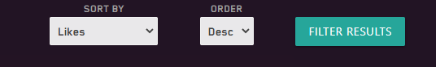

# Testing

## Contents

- [Testing User Stories](#testing-user-stories)

    - [First Time User Goals](#first-time-user-goals)

    - [Returning User Goals](#returning-user-goals)

- [Manual Testing](#manual-testing)

    - [Navigation - Navbar (Desktop)](#navigation---navbar-(desktop))

    - [Navigation - Navbar (Mobile)](#navigation---navbar-(mobile))

-----

## Testing User Stories 

### First Time User Goals 

1. As a first time user I want to immediately understand the purpose of the application.

2. I want to be able to see an about page or an explanation to what this site is and what it can offer me.

- By scrolling down on the Homepage, users can find a small paragaph that explains a little bit about the site. With this the purpose is made clear.

- The site's title 'My Next Game' clearly defines what type of audience the site is suited for, and can help articulate the site's purpose.

-----

3. I want to be able to find games easily.

- Users have a vareity of ways in which they can browse the selection of games that are available to them.

- In the navbar, users can select a game genre, using the Genre dropdown menu, to narrow the results when browsing or searching for a game.

- Users have access to secondary navbar, available on all of the game pages (excluding the Favourites page) which allows them to narrow their search further. 

- Users can select a game genre, search for game by using the search bar, or visit a different page entirely, such as the Favourites page or their Profile Game List.

- Users can also browse all available games, if they are not doing so already, by clicking the 'all games' link.

-----

4. I want to be able to use a sort feature so that I only see the results I want.

 

- The secondary navbar acts a sorting feature, by only displaying game results that match its criteria. For example, clicking the 'Action' button within the Genre Link, will only show games that have the 'Action' game genre tags and/or are primarily categorised as an action game.

- Users can use the searchbar to narrow down their search.

-----

5. I want to be able to register on the site and make a user profile.

- Users can register an account by completing the Register form.

-----

6. I want to see reviews of games, and be able to search for particular game titles or genres of those reviews.

- The Community Reviews page contains all reviews submitted by users.

- The searchbar is available for users to filter these reviews and search for a particular game title.

-----

7. I want to be able to vote on games that I like.

 

- Each game has a like button which allows users to leave likes on games.

- The likes are synchronized acrossed all pages.

-----

8. I want to leave reviews of my own.

9. If I don't know what I'm looking for, I want a site feature that will help me decide what game to play next.

- The 'Leave A Review' button on the Community Reviews page allows users to easily leave reviews of their own.

- By filling out a review form, users can submitted their own reviews which will then be displayed on the Community Reviews page.

- Users can only submit one review per game.

-----

10. I want to see games that are recommended by the site.

 

- The Favourites page stores a collection of games that are recommended. These games have been added manually and contain unique content, such as a game summary and screenshots.

- Users can navigate to the Favourites page by clicking on the 'Explore Our Favourites' button on the Homepage or by clicking the 'Our Favourites' navlink in the secondary navbar.

- Any game that is listed within the Favourites page will have a recommended tag ('Recommended By Us') on the game card. 

-----

11. I want to add games to my personal games list.

 

- When logged in, a Add Button will be available on each game card for users to click on.

- Once clicked, the selected game will be added to their Profile Game List.

- By default, a game that is added to a user's Profile Game List will be added to the 'Play Later' category, but users can customize this further on their Profile page.

-----

### Returning User Goals

1. As a returning user, I want to be able to customize my profile. I want to add a bio to my profile and upload a custom profile image.

 

- After creating an account, users have a the option of customizing their details by clicking on the 'Edit Profile' button on their Profile page.

- On the Edit Profile page, users are able to create a Display Name, edit their email address and add their First and Last name to their Profile.

- On the Edit Profile page, users can navigate to the Avatar page, where they select an Avatar for their profile.

- To make the site more secure, users are required to input their password before any personal details can be changed.

- Each user will be able to see their ID number on the Edit Profile page. This has been included to help implement future security measures. If a user ever needs to contact a site support member about their account, they will be able to provide their ID number to help authenticate their account.

-----

2. I want to be able to see all the reviews that I have made, and have the option to edit or delete them.

- Users can see a list of their reviews via their Profile Page, by clicking on the 'Reviews' button in the sidenav.

- On this page, users can review, edit and/or delete any reviews that they have made.

- Additionally, if a user has submitted a review on a game that is currently in their Profile Game List, then a 'Reviewed' button appear in place of the 'Review' button, which will appear if a user has not left a review. Users can click the pen icon besides the 'Reviewed' button to edit their existing review.

- When clicking either the pen icon or the 'Edit' button, users will be directed to the Review form page, with all the current input fields filled in.

-----

3. I want to update my games list. I want to categories games into what I am currently playing, what I have played and want I want to play in the future.

- Users can update their game list by clicking on the 'Play Later', 'Completed' and/or 'Playing' buttons.

- These buttons will seamlessly move the games to different categories in an easy and intuitive way.

-----

4. I want to see profiles of other users.

5. I want to find the site's contact information so that I can get help on an issue.

6. I want to request new games to be added to the database.

7. I want to add games to a favourites list.

-----

## Manual Testing

### Navigation - Navbar (Desktop)

| No. |   Action    |   Input   |   Expected Output |   Actual Output   |   Result |  Further Comments |
| --- | ----------- | --------- | ----------------- | ----------------- | ---------| ----------------- |
|  1  | Navigate to `Genre` (All Games) page | Click the `Genre` dropdown nav link | The site will navigate to the `Games Page`, listing `all games` within the database | Navigates to `Games Page` and lists `all games` | Pass |
|  2  | Navigate to `Action` Genre page | Click the `Action` nav link within the Genre dropdown menu | The site will navigate to the `Games Page`, listing only the `Action games` within the database | Navigates to `Games Page` and lists all `Action games` | Pass |
|  3  | Navigate to `Adventure` Genre page | Click the `Adventure` nav link within the Genre dropdown menu | The site will navigate to the `Games Page`, listing only the `Adventure games` within the database | Navigates to `Games Page` and lists all `Adventure games` | Pass |
|  4  | Navigate to `RPG` Genre page | Click the `RPG` nav link within the Genre dropdown menu | The site will navigate to the `Games Page`, listing only the `RPG games` within the database | Navigates to `Games Page` and lists all `RPG games` | Pass |
|  5  | Navigate to `Strategy` Genre page | Click the `Strategy` nav link within the Genre dropdown menu | The site will navigate to the `Games Page`, listing only the `Strategy games` within the database | Navigates to `Games Page` and lists all `Strategy games` | Pass |
|  6  | Navigate to `Multiplayer` Genre page | Click the `Multiplayer` nav link within the Genre dropdown menu | The site will navigate to the `Games Page`, listing only the `Multiplayer games` within the database | Navigates to `Games Page` and lists all `Multiplayer games` | Pass |
|  7  | Navigate to `Community Reviews`  page | Click the `Community Reviews` nav link | The site will navigate to the `Community Reviews` page | Navigates to `Community Reviews` page | Pass |
|  8  | Navigate to `Login`  page | Click the `Login` nav link within the `Profile icon` dropdown menu | The site will navigate to the `Login` page | Navigates to `Login` page | Pass |
|  9  | Navigate to `Login`  page | Click the `Login` nav link | The site will navigate to the `Login` page | Navigates to `Login` page | Pass |
|  10  | Navigate to `Login`  page via the Register page | Click the `Log In` link on the Register page | The site will navigate to the `Login` page | Navigates to `Login` page | Pass |
|  11  | `Register` an account | Navigate to the `Register` page and complete the `Register form`; click `Register` | The user will have their account registered and their user credentials will be added to the appropriate MongoDB collection. The user will be directed to their new `Profile` page. A `flash message` should say 'Welcome {username}' | After completing the `register form` the user has their account `registered` and is directed to their `Profile` page. A `flash message` says 'Welcome {username}, which in this case is 'Welcome Firstuser' | Pass |
|  12  | `Log In` | Navigate to the `Login` page and enter credentials; click `Log In` | The user will be `logged in` and directed to their `Profile` page. A `flash message` should say 'Welcome {username}' | After entering user credentials, the user is `'logged in` and directed to their `Profile` page. A `flash message` says 'Welcome {username}, which in this case is 'Welcome Firstuser' | Pass |
|  13  | Navigate to `Profile` page | When logged into an account, hover over the `Profile icon` in the navbar and click on the `Profile` navlink  | The site will navigate to the session user's `Profile` page | Navigates to the session user's `Profile` page | Pass |
|  14  | `Logout` | When logged into an account, hover over the `Profile icon` in the navbar and click on the `Logout` navlink  | The user will be `logged out` and directed to the `Login` page. A `flash message` should say 'You have been logged out' | The user is `logged out` and then directed to the `Login` page. The `flash message` says 'You have been logged out'  | Pass |
|  15  | Navigate to `Homepage` | When on any page other than the Homepage, click the `Home` link in the navbar | The site will navigate to the `Homepage` | Navigates to `Homepage` | Pass |
|  16  | Navigate to `Homepage` | When on any page other than the Homepage, click the `Site Brand Logo` in the navbar | The site will navigate to the `Homepage` | Navigates to `Homepage` | Pass |

### Navigation - Navbar (Mobile)

| No. |   Action    |   Input   |   Expected Output |   Actual Output   |   Result |  Further Comments |
| --- | ----------- | --------- | ----------------- | ----------------- | ---------| ----------------- |
|  1  | Trigger Mobile Sidenav | Using `Chrome DevTools`, toggle device toolbar and change the viewport to a tablet or mobile device with a max width of 992px | The `Home`, `Platform`, `Genre` and `Community Reviews` nav links should disappear. A `hamburger icon` should appear to the right in the their place. When clicked it should trigger the mobile `sidenav` | The navbar collapses at 992px; the `Home`, `Platform`, `Genre` and `Community Reviews`  nav links disappear and in its place is the `hamburger icon`, which opens the `side nav` once clicked | Pass |
|  2  | Navigate to `Genre` (All Games) page | Click the `Genre` nav link inside the mobile `sidenav` | The site will navigate to the `Games Page`, listing `all games` within the database | Navigates to `Games Page` and lists `all games` | Pass |
|  3  | Navigate to `Action` Genre page | Click the `Action` nav link inside the mobile `side nav` | The site will navigate to the `Games Page`, listing only the `Action games` within the database | Navigates to `Games Page` and lists all `Action games` | Pass |
|  4  | Navigate to `Adventure` Genre page | Click the `Adventure` nav link inside the mobile `side nav` | The site will navigate to the `Games Page`, listing only the `Adventure games` within the database | Navigates to `Games Page` and lists all `Adventure games` | Pass |
|  5  | Navigate to `RPG` Genre page | Click the `RPG` nav link inside the mobile `side nav` | The site will navigate to the `Games Page`, listing only the `RPG games` within the database | Navigates to `Games Page` and lists all `RPG games` | Pass |
|  6  | Navigate to `Strategy` Genre page | Click the `Strategy` nav link inside the mobile `side nav` | The site will navigate to the `Games Page`, listing only the `Strategy games` within the database | Navigates to `Games Page` and lists all `Strategy games` | Pass |
|  7  | Navigate to `Multiplayer` Genre page | Click the `Multiplayer` nav link inside the mobile `side nav` | The site will navigate to the `Games Page`, listing only the `Multiplayer games` within the database | Navigates to `Games Page` and lists all `Multiplayer games` | Pass |
|  8  | Navigate to `Community Reviews`  page | Click the `Community Reviews` nav link inside the mobile `side nav` | The site will navigate to the `Community Reviews` page | Navigates to `Community Reviews` page | Pass | **Bug:** Once directed to the `Community Reviews` page, all nav links other than the Site Brand logo disappears. **Fix:** Adding `overflow: hidden` to the HTML tag seems to fix the issue |
|  9  | Trigger `Profile` mobile `sidenav` | Click on the `Profile icon` in the navbar | It should trigger a `sidenav`, to the left, which contains either the `Login` and `Register` navlink, or the `Profile` and `Log Out` navlink | The `sidenav` triggers, opening to the left, once the `Profile icon` is clicked | Pass |
|  10  | Navigate to `Login`  page | Click the `Login` nav link within the `Profile sidenav` | The site will navigate to the `Login` page | Navigates to `Login` page | Pass |
|  11  | Navigate to `Register`  page | Click the `Register` nav link within the `Profile sidenav` | The site will navigate to the `Register` page | Navigates to `Register` page | Pass |
|  12  | Navigate to `Homepage` | When on any page other than the Homepage, click the `Site Brand Logo` in the navbar | The site will navigate to the `Homepage` | Navigates to `Homepage` | Pass |
|  13  | Navigate to `Profile` page | When logged into an account, click the `Profile` navlink within the `Profile sidenav` | The site will navigate to the session user's `Profile` page | Navigates to the session user's `Profile` page | Pass |
|  14  | Logout | When logged into an account, click the `Logout` navlink within the `Profile sidenav` | The user will be `logged out` and directed to the `Login` page. A `flash message` should say 'You have been logged out' | The user is `logged out` and then directed to the `Login` page. The `flash message` says 'You have been logged out'  | Pass |