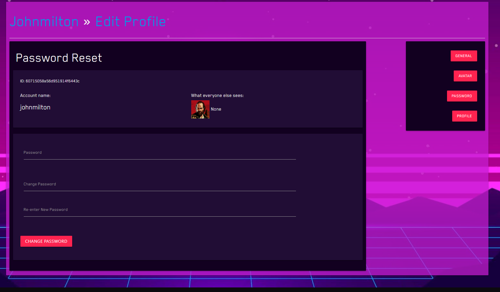

# Testing

## Contents

- [Automated Testing](#automated-testing)

    - [W3C Markup Validation Service](#w3c-markup-validation-service)

    - [W3C CSS Validation Service](#w3c-css-validation-service)

    - [JSHint](#jshint)

    - [PEP8](#pep8)

    - [Page Speed / Performance](#page-performance)

- [Testing User Stories](#testing-user-stories)

    - [First Time User Goals](#first-time-user-goals)

    - [Returning User Goals](#returning-user-goals)


- [Manual Testing](#manual-testing)

    - [Navigation - No Session User](#navigation---no-session-user)

        - [Navigation - Navbar (Desktop)](#navigation---navbar-desktop)

        - [Navigation - Navbar (Mobile)](#navigation---side-nav-mobile)

        - [Navigation - Games Page Secondary Navbar (Desktop)](#navigation---games-page-secondary-navbar-desktop)

        - [Navigation - Games Page Secondary Navbar (Mobile)](#navigation---games-page-secondary-navbar-mobile)

        - [Navigation - Reviews Page Secondary Navbar (Desktop)](#navigation---reviews-page-secondary-navbar-desktop)

        - [Navigation - Reviews Page Secondary Navbar (Mobile)](#navigation---reviews-page-secondary-navbar-mobile)

        - [Navigation - Other](#navigation---other)

    - [Navigation - Session User](#navigation---session-user)

        - [Register Log In and Sign Out (Desktop)](#register-log-in-and-sign-out-desktop)

        - [Navigation - Profile (Mobile)](#navigation---profile-mobile)

        - [Navigation - Profile (Mobile)](#navigation---profile-mobile)

    - [C-R-U-D](#c-r-u-d)

        - [Game Pages, Review Page and Favourites Page](#game-pages-review-page-and-favourites-page)

        - [Profile - Games List](#profile---games-list)

        - [Edit Profile](#edit-profile)

        - [Edit Avatar](#edit-avatar)


- [Bug Fixes](#bug-fixes)

    - [Review Card Collapsible](#review-card-collapsible)

    - [Admin KeyError](#admin-keyerror)

    - [Materialize Tooltip ](#materialize-tooltip)

    - [Edit Profile - Updating Data](#edit-profile---updating-data)

    - [NoneType Error for Request A Game Form](#nonetype-error-for-request-a-game-form)

    - [KeyError when Visiting A User's Profile](#keyerror-when-visiting-a-users-profile)

    - [RenderItem TypeError for Autocomplete Search Bar](#renderitem-typeerror-for=autocomplete-search-bar)

    - [Sort Filter Duplicates](#sort-filter-duplicates)


-----

## Automated Testing


[W3C Markup Validation Service](https://validator.w3.org/), [W3C CSS Validation Service](https://jigsaw.w3.org/css-validator/) and [JShint](https://jshint.com/) were used to validate the project's HTML, CSS and JS files.


### W3C Markup Validation Service

When first running my site through the validator, it picked up some errors:


However, after corrected the errors the validator produced no more errors or warnings:#


### W3C CSS Validation Service

Found no errors in my code.


### JSHint

JShint gave the following warnings in relation to the syntax of my code:

- `'const' is available in ES6 (use 'esversion: 6') or Mozilla JS extensions (use moz).`

- `'let' is available in ES6 (use 'esversion: 6') or Mozilla JS extensions (use moz).`

- `'arrow function syntax (=>)' is only available in ES6 (use 'esversion: 6').`

After deeming these warning undetrimental to the overall functionality of my project, I decided to ignore these warnings. 


### PEP8

All of the Python code was run through a [PEP8 validator](http://pep8online.com/checkresult). 

Some issues relating to white space and too many lines were found but were promptly corrected.


### Page Performance

I used [Google PageSpeed Insights](https://developers.google.com/speed/pagespeed/insights/) to measure the speed and performance of my website.


#### Cache Control

Before cache control:

|  Desktop  |  Mobile  |
| --------- | -------- |
|  |  |


After cache control:

|  Desktop  |  Mobile  |
| --------- | -------- |
|  |  |


-----


## Testing User Stories 

### First Time User Goals 


1. As a first time user I want to immediately understand the purpose of the application.

2. I want to be able to see an about page or an explanation to what this site is and what it can offer me.


- By scrolling down on the Homepage, users can find a small paragaph that explains a little bit about the site. With this the purpose is made clear.

- The site's title 'My Next Game' clearly defines what type of audience the site is suited for, and can help articulate the site's purpose.

-----


3. I want to be able to find games easily.

- Users have a vareity of ways in which they can browse the selection of games that are available to them.

- Users can select a game genre, search for game by using the search bar, or visit a different page entirely, such as the Favourites page or their Profile Game List.


- In the navbar, users can select a game genre, using the Genre dropdown menu, to narrow the results when browsing or searching for a game.


- Users have access to secondary navbar, available on all of the game pages (excluding the Favourites page) which allows them to narrow their search further. 

- Users can also browse all available games, if they are not doing so already, by clicking the 'all games' link.


-----


4. I want to be able to use a sort feature so that I only see the results I want.

 


- The secondary navbar acts a sorting feature, by only displaying game results that match its criteria. For example, clicking the 'Action' button within the Genre Link, will only show games that have the 'Action' game genre tags and/or are primarily categorised as an action game.

- Users can use the searchbar to narrow down their search.

- The sort filter allows users to sort the order of the game results on each page. Users can sort the order of games by:

    - Number of Likes

    - Game Title

    - Recommended Games

    - Bestsellers

    - Award Winners

- For each sort filter, users can chose either an ascending or descending order.

-----


5. I want to be able to register on the site and make a user profile.


- Users can register an account by completing the Register form.

-----


6. I want to see reviews of games, and be able to search for particular game titles or genres of those reviews.


- The Community Reviews page contains all reviews submitted by users.

- The searchbar is available for users to filter these reviews and search for a particular game title.

-----


7. I want to be able to vote on games that I like.


- Each game has a like button which allows users to leave likes on games.

- The likes are synchronized acrossed all pages.

-----


8. I want to leave reviews of my own.


- The 'Leave A Review' button on the Community Reviews page allows users to easily leave reviews of their own.

- By filling out a review form, users can submitted their own reviews which will then be displayed on the Community Reviews page.

- Users can only submit one review per game.

-----


10. I want to see games that are recommended by the site.


- The Favourites page stores a collection of games that are recommended. These games have been added manually and contain unique content, such as a game summary and screenshots.

- Users can navigate to the Favourites page by clicking on the 'Explore Our Favourites' button on the Homepage or by clicking the 'Our Favourites' navlink in the secondary navbar.

- Any game that is listed within the Favourites page will have a recommended tag ('Recommended By Us') on the game card. 

-----


11. I want to add games to my personal games list.


 

- When logged in, an Add Button will be available on each game card for users to click on.

- Once clicked, the selected game will be added to their Profile Game List.

- By default, a game that is added to a user's Profile Game List will be added to the 'Play Later' category, but users can customize this further on their Profile page.

-----


### Returning User Goals

1. As a returning user, I want to be able to customize my profile. I want to add a bio to my profile and upload a custom profile image.




- After creating an account, users have a the option of customizing their details by clicking on the 'Edit Profile' button on their Profile page.

- On the Edit Profile page, users are able to create a Display Name, edit their email address and add their First and Last name to their Profile.

- On the Edit Profile page, users can navigate to the Avatar page, where they select an Avatar for their profile.

- To make the site more secure, users are required to input their password before any personal details can be changed.

- Each user will be able to see their ID number on the Edit Profile page. This has been included to help implement future security measures. If a user ever needs to contact a site support member about their account, they will be able to provide their ID number to help authenticate their account.

-----


2. I want to be able to see all the reviews that I have made, and have the option to edit or delete them.


- Users can see a list of their reviews via their Profile Page, by clicking on the 'Reviews' button in the sidenav.

- On this page, users can review, edit and/or delete any reviews that they have made.

- Additionally, if a user has submitted a review on a game that is currently in their Profile Game List, then a 'Reviewed' button appear in place of the 'Review' button, which will appear if a user has not left a review. Users can click the pen icon besides the 'Reviewed' button to edit their existing review.

- When clicking either the pen icon or the 'Edit' button, users will be directed to the Review form page, with all the current input fields filled in.

-----


3. I want to update my games list. I want to categories games into what I am currently playing, what I have played and want I want to play in the future.


- Users can update their game list by clicking on the 'Play Later', 'Completed' and/or 'Playing' buttons.

- These buttons will seamlessly move the games to different categories in an easy and intuitive way.

-----

4. I want to see profiles of other users.


- Clicking on the username/display name of a review card on the Community Reviews page, will direct users to the Profile page of that user.

- Users cannot edit profile settings and/or modify the game playlist when visiting another user's Profile.


----

5. I want to find the site's contact information so that I can get help on an issue.


----

6. I want to request new games to be added to the database.


- Users can navigate to the Request A Game page via the 'Request A Game` buttons on either the Favourites page and/or when no results are available after using the searchbar.

- Once on the Request A Game page, users can then submit a form in order to request games to be added to the database.


-----


-----


## Manual Testing


### Navigation - No Session User


#### Navigation - Navbar (Desktop)

| No. |   Action    |   Input   |   Expected Output |   Actual Output   |   Result |  Further Comments |
| --- | ----------- | --------- | ----------------- | ----------------- | ---------| ----------------- |
|  1  | Navigate to `Genre` (All Games) page | Click the `Genre` nav link | The site will navigate to the `Games Page`, listing `all games` within the database | Navigates to `Games Page` and lists `all games` | Pass |
|  2  | Navigate to `Action` Genre page | Click the `Action` nav link within the Genre dropdown menu | The site will navigate to the `Games Page`, listing only the `Action games` within the database | Navigates to `Games Page` and lists all `Action games` | Pass |
|  3  | Navigate to `Adventure` Genre page | Click the `Adventure` nav link within the Genre dropdown menu | The site will navigate to the `Games Page`, listing only the `Adventure games` within the database | Navigates to `Games Page` and lists all `Adventure games` | Pass |
|  4  | Navigate to `RPG` Genre page | Click the `RPG` nav link within the Genre dropdown menu | The site will navigate to the `Games Page`, listing only the `RPG games` within the database | Navigates to `Games Page` and lists all `RPG games` | Pass |
|  5  | Navigate to `Strategy` Genre page | Click the `Strategy` nav link within the Genre dropdown menu | The site will navigate to the `Games Page`, listing only the `Strategy games` within the database | Navigates to `Games Page` and lists all `Strategy games` | Pass |
|  6  | Navigate to `Multiplayer` Genre page | Click the `Multiplayer` nav link within the Genre dropdown menu | The site will navigate to the `Games Page`, listing only the `Multiplayer games` within the database | Navigates to `Games Page` and lists all `Multiplayer games` | Pass |
|  7  | Navigate to `Community Reviews`  page | Click the `Community Reviews` nav link | The site will navigate to the `Community Reviews` page | Navigates to `Community Reviews` page | Pass |
|  8  | Navigate to `Login`  page | Click the `Login` nav link | The site will navigate to the `Login` page | Navigates to `Login` page | Pass |
|  9  | Navigate to `Homepage` | When on any page other than the Homepage, click the `Home` nav link | The site will navigate to the `Homepage` | Navigates to `Homepage` | Pass |
|  10  | Navigate to `Our Favourites` | Click the `Our Favourites` nav link | The site will navigate to the `Our Favourites` page | Navigates to `Our Favourites` page | Pass |


#### Navigation - Side Nav (Mobile)

| No. |   Action    |   Input   |   Expected Output |   Actual Output   |   Result |  Further Comments |
| --- | ----------- | --------- | ----------------- | ----------------- | ---------| ----------------- |
|  1  | Trigger Mobile Sidenav | Using `Chrome DevTools`, toggle device toolbar and change the viewport to a tablet or mobile device with a max width of 992px | The `Home`, `Our Favourites`, `Genre` and `Community Reviews` nav links should disappear. A `hamburger icon` should appear to the right in the their place. When clicked it should trigger the mobile `sidenav` | The navbar collapses at 992px; the `Home`, `Our Favourites`, `Genre` and `Community Reviews`  nav links disappear and in its place is the `hamburger icon`, and `profile icon` which opens the `side nav` once clicked | Pass |
|  2  | Navigate to `Our Favourites` page | Click the hamburger icon to access the side nav. Inside the side nav click the `Our Favourites` nav link | The site will navigate to the `Our Favourites` page | Navigates to `Our Favourites` page | Pass |
|  3  | Navigate to `Homepage` | While still on the `Our Favourites` page, open the `side nav` and click the `Home` nav link | The site will navigate to the `Homepage` | Navigates to `Homepage` | Pass |
|  4  | Navigate to `All Games` page | Open the `side nav` and click the `Games` collapsible link. The collapsible menu will trigger, and more nav links will show beneath it. Click the `All Games` nav link  | Clicking `Games` should open the collapsible, and all the genre links for the game pages should appear below it. Clicking `All Games` should navigate to the `Games Page`, listing `all games` within the database | The collapsible opens, and clicking `All Games` navigates to `Games Page`, listing `all games` in the database | Pass |
|  3  | Navigate to `Action` game page | Click the `Action` nav link inside the collapsible within the mobile `side nav` | The site will navigate to the `Games Page`, listing only the `Action games` within the database | Navigates to `Games Page` and lists all `Action games` | Pass |
|  4  | Navigate to `Adventure` game page | Click the `Adventure` nav link inside the collapsible within the mobile `side nav` | The site will navigate to the `Games Page`, listing only the `Adventure games` within the database | Navigates to `Games Page` and lists all `Adventure games` | Pass |
|  5  | Navigate to `RPG` game page | Click the `RPG` nav link inside the collapsible within the mobile `side nav` | The site will navigate to the `Games Page`, listing only the `RPG games` within the database | Navigates to `Games Page` and lists all `RPG games` | Pass |
|  6  | Navigate to `Strategy` game page | Click the `Strategy` nav link inside the collapsible within the mobile `side nav` | The site will navigate to the `Games Page`, listing only the `Strategy games` within the database | Navigates to `Games Page` and lists all `Strategy games` | Pass |
|  7  | Navigate to `Multiplayer` game page | Click the `Multiplayer` nav link inside the collapsible within the mobile `side nav` | The site will navigate to the `Games Page`, listing only the `Multiplayer games` within the database | Navigates to `Games Page` and lists all `Multiplayer games` | Pass |
|  8  | Navigate to `Award Winners` game page | Click the `Award Winners` nav link inside the collapsible within the mobile `side nav` | The site will navigate to the `Games Page`, listing only the `Award Winners games` within the database | Navigates to `Games Page` and lists all `Award Winners games` | Pass |
|  9  | Navigate to `Community Reviews`  page | Click the `Community Reviews` nav link inside the mobile `side nav` | The site will navigate to the `Community Reviews` page | Navigates to `Community Reviews` page | Pass | **Bug:** Once directed to the `Community Reviews` page all nav links disappear. **Fix:** Adding `overflow: hidden` to the HTML tag seems to fix the issue |
|  10  | Trigger `Profile` mobile `sidenav` | Click on the `Profile icon` in the navbar | It should trigger a `sidenav`, to the left, which contains either the `Login` and `Register` navlink, or the `Profile` and `Log Out` navlink | The `sidenav` triggers, opening to the left, once the `Profile icon` is clicked | Pass |
|  11  | Navigate to `Login`  page | Click the `Login` nav link within the `Profile sidenav` | The site will navigate to the `Login` page | Navigates to `Login` page | Pass |
|  12  | Navigate to `Register`  page | Click the `Register` nav link within the `Profile sidenav` | The site will navigate to the `Register` page | Navigates to `Register` page | Pass |


#### Navigation - Games Page Secondary Navbar (Desktop)

| No. |   Action    |   Input   |   Expected Output |   Actual Output   |   Result |  Further Comments |
| --- | ----------- | --------- | ----------------- | ----------------- | ---------| ----------------- |
|  1  | Navigate to `Our Favourites` page | Navigate to the Games page and find the `secondary navbar` under the carousel. Click the `Our Favourites` navlink | It should direct to the `Our Favourites` page | Directs to `Our Favourites` page | Pass |
|  2  | Navigate to `Award Winners` game page | Navigate back to the Games page and click the `Award Winners` navlink within the `secondary navbar` | It should direct to the `Award Winners` game page | Directs to `Award Winners` game page | Pass |
|  3  | Show Genre tags | Click the `Genre` link in the `secondary navbar` | It should display all of the genre links (`Action`, `Adventure`, `RPG`, `Strategy` and `Multiplayer`) and the `Genre` link should no longer be visible | Displays all genre links. The `Genre` link itself is no longer visible | Pass |
|  4  | List `Action` games | After clicking the `Genre` link as described above, click the `Action` link inside the collapsible within the mobile `side nav` | The site will list only the `Action games` within the database | Lists all `Action games` | Pass |
|  5  | List `Adventure` games | Click the `Adventure` link | The site will list only the `Adventure games` within the database | Lists all `Adventure games` | Pass |
|  6  | List `RPG` games | Click the `RPG` link | The site will list only the `RPG games` within the database | Lists all `RPG games` | Pass |
|  7  | List `Strategy` games | Click the `Strategy` link | The site will list only the `Strategy games` within the database | Lists all `Strategy games` | Pass |
|  8  | List `Multiplayer` games | Click the `Multiplayer` link | The site will list only the `Multiplayer games` within the database | Lists all `Multiplayer games` | Pass |
|  9  | List `all games` | Click the `All Games` link | The site will list `all games` within the database | Lists all `all games` | Pass |


#### Navigation - Games Page Secondary Navbar (Mobile)

| No. |   Action    |   Input   |   Expected Output |   Actual Output   |   Result |  Further Comments |
| --- | ----------- | --------- | ----------------- | ----------------- | ---------| ----------------- |
|  1  | Trigger Mobile Sidenav | Using `Chrome DevTools`, toggle device toolbar and change the viewport to a tablet or mobile device with a max width of 992px | The `Our Favourites`, `Award Winners`, `Genre` links should disappear. A `hamburger icon` should appear to the left in the their place. When clicked it should trigger the mobile `sidenav` which should open to the left | The navbar collapses at 992px; the `Our Favourites`, `Award Winners`, `Genre` links disappear and in its place is the `hamburger icon` appears. which opens the `side nav` to the left once clicked | Pass |
|  2  | Navigate to `Our Favourites` page | Click the `Our Favourites` navlink within the `side nav` of the `secondary navbar` | It should direct to the `Our Favourites` page | Directs to `Our Favourites` page | Pass |
|  3  | Navigate to `Award Winners` game page | Click the `Award Winners` navlink within the `side nav` of the `secondary navbar` | It should direct to the `Award Winners` game page | Directs to `Award Winners` game page | Pass |
|  4  | List `Action` games | Click the `Action` navlink within the `side nav` of the `secondary navbar` | The site will list only the `Action games` within the database | Lists all `Action games` | Pass |
|  5  | List `Adventure` games | Click the `Adventure` navlink within the `side nav` of the `secondary navbar` | The site will list only the `Adventure games` within the database | Lists all `Adventure games` | Pass |
|  6  | List `RPG` games | Click the `RPG` navlink within the `side nav` of the `secondary navbar` | The site will list only the `RPG games` within the database | Lists all `RPG games` | Pass |
|  7  | List `Strategy` games | Click the `Strategy` navlink within the `side nav` of the `secondary navbar` | The site will list only the `Strategy games` within the database | Lists all `Strategy games` | Pass |
|  8  | List `Multiplayer` games | Click the `Multiplayer` navlink within the `side nav` of the `secondary navbar` | The site will list only the `Multiplayer games` within the database | Lists all `Multiplayer games` | Pass |
|  9  | List `all games` | Click the `All Games` navlink within the `side nav` of the `secondary navbar` | The site will list `all games` within the database | Lists all `all games` | Pass |


#### Navigation - Reviews Page Secondary Navbar (Desktop)

| No. |   Action    |   Input   |   Expected Output |   Actual Output   |   Result |  Further Comments |
| --- | ----------- | --------- | ----------------- | ----------------- | ---------| ----------------- |
|  1  | Show Genre tags | Click the `Genre` link in the `secondary navbar` | It should display all of the genre links (`Action`, `Adventure`, `RPG`, `Strategy` and `Multiplayer`) and the `Genre` link should no longer be visible | Displays all genre links. The `Genre` link itself is no longer visible | Pass |
|  2  | List `Action` game reviews | After clicking the `Genre` link as described above, click the `Action` link inside the collapsible within the mobile `side nav` | The site will list only the `Action game reviews` within the database | Lists all `Action game reviews` | Pass |
|  3  | List `Adventure` game reviews | Click the `Adventure` link | The site will list only the `Adventure game reviews` within the database | Lists all `Adventure game reviews` | Pass |
|  4  | List `RPG` game reviews | Click the `RPG` link | The site will list only the `RPG game reviews` within the database | Lists all `RPG game reviews` | Pass |
|  5  | List `Strategy` game reviews | Click the `Strategy` link | The site will list only the `Strategy game reviews` within the database | Lists all `Strategy game reviews` | Pass |
|  6  | List `Multiplayer` game reviews | Click the `Multiplayer` link | The site will list only the `Multiplayer game reviews` within the database | Lists all `Multiplayer game reviews` | Pass |
|  7  | Show Platform tags | Click the `Platform` link in the `secondary navbar` | It should display all of the platform links (`PC`, `XBOX`, `Playstation` and `Nintendo`) and the `Platform` link should no longer be visible | Displays all platform links. The `Platform` link itself is no longer visible | Pass |
|  8  | List `PC` game reviews | After clicking the `Platform` link as described above, click the `PC` link inside the collapsible within the mobile `side nav` | The site will list only the `PC game reviews` within the database | Lists all `PC game reviews` | Pass |
|  9  | List `XBOX` game reviews | Click the `XBOX` link | The site will list only the `XBOX game reviews` within the database | Lists all `XBOX game reviews` | Pass |
|  10  | List `Playstation` game reviews | Click the `Playstation` link | The site will list only the `Playstation game reviews` within the database | Lists all `Playstation game reviews` | Pass |
|  11  | List `Nintendo` game reviews | Click the `Nintendo` link | The site will list only the `Nintendo game reviews` within the database | Lists all `Nintendo game reviews` | Pass |
|  12  | List `all reviews` | Click the `All Reviews` link | The site will list `all reviews` within the database | Lists all `all reviews` | Pass |


#### Navigation - Reviews Page Secondary Navbar (Mobile)

| No. |   Action    |   Input   |   Expected Output |   Actual Output   |   Result |  Further Comments |
| --- | ----------- | --------- | ----------------- | ----------------- | ---------| ----------------- |
|  1  | Trigger Mobile Sidenav | Using `Chrome DevTools`, toggle device toolbar and change the viewport to a tablet or mobile device with a max width of 992px | The `Platform` and `Genre` links should disappear. A `hamburger icon` should appear to the left in the their place. When clicked it should trigger the mobile `sidenav` which should open to the left | The navbar collapses at 992px; the `Platform` and `Genre` links disappear and in its place is the `hamburger icon` appears. which opens the `side nav` to the left once clicked | Pass |
|  2  | List `PC` game reviews | Click the `PC` navlink within the `side nav` of the `secondary navbar` | The site will list only the `PC game reviews` within the database | Lists all `PC game reviews` | Pass |
|  3  | List `XBOX` game reviews | Click the `XBOX` navlink within the `side nav` of the `secondary navbar` | The site will list only the `XBOX game reviews` within the database | Lists all `XBOX game reviews` | Pass |
|  4  | List `Playstation` game reviews | Click the `Playstation` navlink within the `side nav` of the `secondary navbar` | The site will list only the `Playstation game reviews` within the database | Lists all `Playstation game reviews` | Pass |
|  5  | List `Nintendo` game reviews | Click the `Nintendo` navlink within the `side nav` of the `secondary navbar` | The site will list only the `Nintendo game reviews` within the database | Lists all `Nintendo game reviews` | Pass |
|  6  | List `Action` game reviews | Click the `Action` navlink within the `side nav` of the `secondary navbar` | The site will list only the `Action game reviews` within the database | Lists all `Action game reviews` | Pass |
|  7  | List `Adventure` game reviews | Click the `Adventure` navlink within the `side nav` of the `secondary navbar` | The site will list only the `Adventure game reviews` within the database | Lists all `Adventure game reviews` | Pass |
|  8  | List `RPG` game reviews | Click the `RPG` navlink within the `side nav` of the `secondary navbar` | The site will list only the `RPG game reviews` within the database | Lists all `RPG game reviews` | Pass |
|  9  | List `Strategy` game reviews | Click the `Strategy` navlink within the `side nav` of the `secondary navbar` | The site will list only the `Strategy game reviews` within the database | Lists all `Strategy game reviews` | Pass |
|  10  | List `Multiplayer` game reviews | Click the `Multiplayer` navlink within the `side nav` of the `secondary navbar` | The site will list only the `Multiplayer game reviews` within the database | Lists all `Multiplayer game reviews` | Pass |
|  11  | List `all reviews` | Click the `All Reviews` navlink within the `side nav` of the `secondary navbar` | The site will list `all reviews` within the database | Lists all `all reviews` | Pass |


#### Navigation - Other

| No. |   Action    |   Input   |   Expected Output |   Actual Output   |   Result |  Further Comments |
| --- | ----------- | --------- | ----------------- | ----------------- | ---------| ----------------- |
|  1  | Navigate to `Register`  page | Navigate to the `Log In` page and click the `Sign Up` link | The site will navigate to the `Register` page | Navigates to `Register` page | Pass |
|  2  | Navigate to `Login`  page via the Register page | Click the `Log In` link on the Register page | The site will navigate to the `Login` page | Navigates to `Login` page | Pass |
|  3  | Navigate to `Favourites` page | When on the `Homepage`, click the `Explore Our Favourites` button | It should direct to the `Our Favourites` page | Directs to `Favourites` page | Pass |
|  4  | Navigate to `Submit Review` page | When on the`Community Reviews` page, click the `Leave a Review` button | It should direct to the `Submit Review` page | Directs to `Submit Review` page | Pass |
|  5  | Navigate to a specific `game review` | When on the`Homepage`, scroll down to the games list. Click on a game card under the `Bestsellers` heading | It should direct to the `Community Reviews` page. The review results should only be for the game that was clicked. The carousel should be a static image of the game and only the reviews for that game should be displayed. If there are no reviews for the game, a card saying: 'Sorry, but we couldn't find what you're looking for' should be displayed instead | Directs to the `Community Reviews` page, displaying all reviews for that game. When no reviews were present, the card saying: 'Sorry, but we couldn't find what you're looking for' is displayed instead. The carousel is static, and shown only the image for the game that was clicked on the Homepage | Pass | Tested for the following games: 'Valheim', 'Evil Genius 2: World Domination', 'Hades', 'Rust', 'Red Dead Redemption 2'; 'Risk of Rain 2' |
|  6  | Navigate to a specific `game review` - 2 | When on the`Homepage`, scroll down to the games list. Click on a game card under the `Award Winners` heading | It should direct to the `Community Reviews` page. The review results should only be for the game that was clicked. The carousel should be a static image of the game and only the reviews for that game should be displayed. If there are no reviews for the game, a card saying: 'Sorry, but we couldn't find what you're looking for' should be displayed instead | Directs to the `Community Reviews` page, displaying all reviews for that game. When no reviews were present, the card saying: 'Sorry, but we couldn't find what you're looking for' is displayed instead. The carousel is static, and shown only the image for the game that was clicked on the Homepage | Pass | Tested for the following games: 'Fall Guys: Ultimate Knockout', 'Red Dead Redemption 2', 'Half-Life: Alyx', 'Death Stranding'; 'DOOM Eternal' |
|  7  | `Pagination` - Homepage |  When on the`Homepage`, scroll down to the games list. Click the arrow indicators for the pagination links under the games list for `Bestsellers` | It should go to the next page for `Bestsellers` | It goes to to the next page | Pass | Although this is not a bug, when clicking the next pagination link the page will refresh and scroll to the top. This is something I would like to address in the future in order to improve the user experience |
|  8  | Navigate to `Community Reviews` page | When on the `Our Favourites` page, click the `See Reviews` button | It should direct to the `Community Reviews` page | Directs to `Community Reviews` page | Pass |
|  9  | `Request A Game` notification | When on the `Our Favourites` page, click the `Request A Game` button | As no session user is logged in, it should trigger a `tooltip`, which says, 'Please sign in or register an account with us to request games'| Clicking the button triggers the `tooltip`  | Pass |
|  10  | `Scroll to Top` button | When on the `Our Favourites` page, scroll down and click the `Scroll To Top` button | The page should scroll back to the top of the page | Clicking the button scrolls to the top of the page  | Pass |
|  11  |  Navigate to a specific `game review` | When on the `Our Favourites` page, scroll down to the game card and click on the `See Reviews` button for a game | It should direct to the `Community Reviews` page, showing only the reviews for that game. The carousel should be a static image of the game and only the reviews for that game should be displayed. If there are no reviews for the game, a card saying: 'Sorry, but we couldn't find what you're looking for' should be displayed instead |  Directs to the `Community Reviews` page, displaying all reviews for that game. When no reviews were present, the card saying: 'Sorry, but we couldn't find what you're looking for' is displayed instead. The carousel is static, and shown only the image for the game that was clicked on the Our Favourites page | Pass | Tested for the following games: 'Red Dead Redemption 2', 'Grand Theft Auto V', 'Vampyr', 'Mount and Blade II Bannerlord'; 'The Elder Scrolls V: Skyrim Special Edition' |
|  12  |  Navigate to a specific `game review` - 1 | When on the `Our Favourites` page, scroll down to the game card and click on a game card's title | It should direct to the `Community Reviews` page, showing only the reviews for that game. The carousel should be a static image of the game and only the reviews for that game should be displayed. If there are no reviews for the game, a card saying: 'Sorry, but we couldn't find what you're looking for' should be displayed instead |  Directs to the `Community Reviews` page, displaying all reviews for that game. When no reviews were present, the card saying: 'Sorry, but we couldn't find what you're looking for' is displayed instead. The carousel is static, and shown only the image for the game that was clicked on the Our Favourites page | Pass | Tested for the following games: 'A Plague Tale: Innocence', 'Crusader Kings III', 'Mount and Blade II Bannerlord'; 'Bioshock Remastered' |
|  13  |  Navigate to a specific `game review` - 2 | When on a `Games` page, click on a game image within one of the game cards | It should direct to the `Community Reviews` page, showing only the reviews for that game. The carousel should be a static image of the game and only the reviews for that game should be displayed. If there are no reviews for the game, a card saying: 'Sorry, but we couldn't find what you're looking for' should be displayed instead |  Directs to the `Community Reviews` page, displaying all reviews for that game. When no reviews were present, the card saying: 'Sorry, but we couldn't find what you're looking for' is displayed instead. The carousel is static, and shown only the image for the game that was clicked on the Games page | Pass | Tested for the following games: 'Valheim', 'Hades', 'It Takes Two'; 'Left 4 Dead 2' |
|  14  |  Navigate to a specific `game review` - 3 | When on the `Community Reviews` page, click on a game image within one of the review cards | It should show only the reviews for that game. The carousel should be a static image of the game and only the reviews for that game should be displayed |  Directs to the `Community Reviews` page, displaying all reviews for that game. The carousel is static, and shown only the image for the game that was clicked on the Our Favourites page | Pass | Tested for the following games: 'Hunt: Showdown', 'Rust', 'Red Dead Redemption 2'; 'Mass Effect Legendary Edition' |
|  15  |  Navigate to a specific `game review` - 4 | When on a `Games` page, click on a game image within the `carousel` | It should show only the reviews for that game. The carousel should be a static image of the game and only the reviews for that game should be displayed |  Directs to the `Community Reviews` page, displaying all reviews for that game. When no reviews were present, the card saying: 'Sorry, but we couldn't find what you're looking for' is displayed instead. The carousel is static, and shown only the image for the game that was clicked on the Games page | Pass | Tested for the following games: 'Vampyr', 'Mordhau', 'Star Wars Battelfront II'; 'Death Stranding'  |
|  16  | Test all of the above on mobile | n/a | n/a | n/a | Pass |
|  17  | `Visit Other User Profiles` |  Navigate to the `Community Reviews` page and find a review card. Click on the `username` of the review card | It should navigate to the `Profile page` of that user | KeyError | Fail | Navigating to user's Profile page when no session user was logged in triggerd a KeyError. See [here](#keyerror-when-visiting-a-users-profile) for its fix |
|  18  | `Visit Other User Profiles` - after fix |  Navigate to the `Community Reviews` page and find a review card. Click on the `username` of the review card | It should navigate to the `Profile page` of that user | Navigates to the user's Profile page | Pass |


------

### Navigation - Session User


#### Register Log In and Sign Out (Desktop)

| No. |   Action    |   Input   |   Expected Output |   Actual Output   |   Result |  Further Comments |
| --- | ----------- | --------- | ----------------- | ----------------- | ---------| ----------------- |
|  1  | `Register` an account | Navigate to the `Register` page by first navigating to the `Log In` page and then clicking the `Sign Up` link. Complete the `Register form` and click `Register` | The user will have their account registered and their user credentials will be added to the appropriate MongoDB collection. The user will be directed to their new `Profile` page. A `flash message` should say 'Welcome {username}' | After completing the `register form` the user has their account `registered` and is directed to their `Profile` page. A `flash message` says 'Welcome {username}, which in this case is 'Welcome Firstuser' | Pass |
|  2  | `Log Out`  | Hover over the `Profile icon` in the navbar and click `Log Out` | You should be logged out and directed to the `Log In` page | Clicking the link successfully logs me out and directs me back to the `Log In`. A flash message says 'You have been logged out' to confirm that the action was successful | Pass |
|  3  | `Log In` | Navigate to the `Login` page and enter credentials; click `Log In` | The user will be `logged in` and directed to their `Profile` page. A `flash message` should say 'Welcome {username}' | After entering user credentials, the user is `'logged in` and directed to their `Profile` page. A `flash message` says 'Welcome {username}, which in this case is 'Welcome Firstuser' | Pass |


#### Register Log In and Sign Out (Mobile)

| No. |   Action    |   Input   |   Expected Output |   Actual Output   |   Result |  Further Comments |
| --- | ----------- | --------- | ----------------- | ----------------- | ---------| ----------------- |
|  1  | `Register` an account | Click the `profile icon` nav link to open the side nav and click the register link to navigate to the `Register` page Complete the `Register form` and click `Register` | The user will have their account registered and their user credentials will be added to the appropriate MongoDB collection. The user will be directed to their new `Profile` page. A `flash message` should say 'Welcome {username}' | After completing the `register form` the user has their account `registered` and is directed to their `Profile` page | Pass |
|  2  | `Log Out`  | Click the `profile icon` nav link to open the side nav and click `Log Out` | You should be logged out and directed to the `Log In` page | Clicking the link successfully logs me out and directs me back to the `Log In`. A flash message says 'You have been logged out' to confirm that the action was successful | Pass |
|  3  | `Log In` | Click the `profile icon` nav link to open the side nav and click `Log In` to navigate to the `Login` page and enter credentials; click `Log In` | The user will be `logged in` and directed to their `Profile` page. A `flash message` should say 'Welcome {username}' | After entering user credentials, the user is `logged in` and directed to their `Profile` page. A `flash message` says 'Welcome {username} | Pass |


#### Navigation - Profile (Desktop)

| No. |   Action    |   Input   |   Expected Output |   Actual Output   |   Result |  Further Comments |
| --- | ----------- | --------- | ----------------- | ----------------- | ---------| ----------------- |
|  1  | Navigate to `Profile - Reviews` page | When on the `Profile` page, click the `Reviews` button in the sidenav - to the right | It should direct to the `Profile - Reviews` page | Directs to `Profile - Reviews` page | Pass |
|  2  | Navigate to `Profile - Games` page (default page for the Profile) | While still on the `Profile - Reviews` page, click the `Games` button in the sidenav | Direct to the `Profile - Games` page (the default page whenever the `Profile` navlink is clicked) | Directs to `Profile - Games` page | Pass |  
|  3  | Navigate to `Edit Profile` page | When on the `Profile` page, click the `Edit Profile` button in the sidenav | Direct to `Edit Profile` page | Directs to `Edit Profile` page | Pass |      
|  4  | Navigate to `Edit Profile - Avatar` page | While still on the `Edit Profile` page, click the `Avatar` button in the sidenav | It should direct to `Edit Profile - Avatar` page | Directs to `Edit Profile - Avatar` page | Pass |  
|  5  | Navigate to `Edit Profile - General` page (default page for Edit Profile) | While still on the `Edit Profile - Avatar` page, click the `General` button in the sidenav | It should direct to `Edit Profile - General` page (default page for Edit Profile) | Directs to `Edit Profile - General` page | Pass |
|  6  | Navigate to `Edit Profile - General` page (2) | While on the `Edit Profile - Avatar` page, click the `Edit Profile` link heading at the top of the card | It should direct to `Edit Profile - General` page | Directs to `Edit Profile - General` page | Pass |
|  7  | Navigate back to `Profile` page | While on any of the `Edit Profile` pages, click the `username` link heading at the top of the card | It should direct back to the `Profile - Games` page | Directs to `Profile - Games` page | Pass |   


#### Navigation - Profile (Mobile)

| No. |   Action    |   Input   |   Expected Output |   Actual Output   |   Result |  Further Comments |
| --- | ----------- | --------- | ----------------- | ----------------- | ---------| ----------------- |
|  1  | Navigate to `Profile - Reviews` page | When on the `Profile` page, click the `Reviews` button | It should direct to the `Profile - Reviews` page | Directs to `Profile - Reviews` page | Pass |
|  2  | Navigate to `Profile - Games` page (default page for the Profile) | While still on the `Profile - Reviews` page, click the `Games` button | Direct to the `Profile - Games` page (the default page whenever the `Profile` navlink is clicked) | Directs to `Profile - Games` page | Pass |  
|  3  | Navigate to `Edit Profile` page | When on the `Profile` page, click the `Edit Profile` button | Direct to `Edit Profile` page | Directs to `Edit Profile` page | Pass |  
|  4  | Navigate to `Edit Profile - Avatar` page | While still on the `Edit Profile` page, click the `Avatar` button | It should direct to `Edit Profile - Avatar` page | Directs to `Edit Profile - Avatar` page | Pass |  
|  5  | Navigate to `Edit Profile - General` page (default page for Edit Profile) | While still on the `Edit Profile - Avatar` page, click the `General` button | It should direct to `Edit Profile - General` page (default page for Edit Profile) | Directs to `Edit Profile - General` page | Pass |
|  6  | Navigate to `Edit Profile - General` page (2) | While on the `Edit Profile - Avatar` page, click the `Edit Profile` link heading at the top of the card | It should direct to `Edit Profile - General` page | Directs to `Edit Profile - General` page | Pass |
|  7  | Navigate back to `Profile` page | While on any of the `Edit Profile` pages, click the `username` link heading at the top of the card | It should direct back to the `Profile - Games` page | Directs to `Profile - Games` page | Pass |
|  8  | Navigate back to `Profile` page (2) | While on any of the `Edit Profile` pages, click the `Back to Profile` link below the heading | It should direct back to the `Profile - Games` page | Directs to `Profile - Games` page | Pass |      


#### Navigation - Other

| No. |   Action    |   Input   |   Expected Output |   Actual Output   |   Result |  Further Comments |
| --- | ----------- | --------- | ----------------- | ----------------- | ---------| ----------------- |
|  1  | Navigate to `Request A Game` page | Click the `Request A Game` nav link in the navbar | Should navigate to the `Request A Game` page | Navigates to `Request A Game` page | Pass |
|  2  | Navigate to `Profile Playlsit` via the secondary navbar on the `Games` page | Navigate to a `Games` page and click the `Your List` link in the secondary navbar | It should navigate to your `Profile Page` | Navigates to the `Profile page` | Pass |


------

### C-R-U-D


#### Game Pages, Review Page and Favourites Page

| No. |   Action    |   Input   |   Expected Output |   Actual Output   |   Result |  Further Comments |
| --- | ----------- | --------- | ----------------- | ----------------- | ---------| ----------------- |
|  1  | `Like` a game when **not** logged in | Click any game card's `like button` on the `Games` page. Ensure you are **not** logged in | A `tooltip` should trigger, and no like should be added | Once clicking on the `like button` a `tooltip` is triggered above it, saying 'Please sign in or register an account with us to leave likes on games' | Pass |
|  2  | **Sign in** and `Like` a game | Click any game card's `like button` on the `Games` page. Ensure you **are** logged in and like a game that you **have not** liked before | Your like should be added to the database and a `flash message` should appear notifying you that your like was successful. The `like count` on the game card should increment by 1 | After clicking the `like button` a `flash message` appears, saying 'Liked added!'. The `like count` is incremented by 1 | Pass |
|  3  | `Add a game` to a user's `Game List` | When logged in, click any game card's floating `add button` on the `Games` page. Click on a game that **does not** already exisit in your `Games List` | A `flash message` should notify you that your action was successful and the game should be added to the 'Play Later' section of your `Games List`. Visit the `Profile` page to check | A `flash message` says 'Game Successfully Added to List' and the game is added to the 'Play Later' section of the `Games List` | Pass | The floating `add button` does **not** show when a user is **not** logged in, as intended |
|  4  | `Add a game` to a user's `Game List` that **already exisits** | When logged in, click a game card's floating `add button` on the `Games` page. Ensure that the game you pick **already exisits** in your `Games List` | A `flash message` should notify you that your action was **not** successful because the game already exisits in your `Games List`. If you were to go on the `Profile - Games List` page, only **one copy** of the game should be present | A `flash message` says 'You've Already Added This Game'. The game was **not** added again to the `Games List` | Pass | The floating `add button` is **only** visible when a user **is** logged in, as intended |
|  5  | `Submit Review` when **not** logged in | Navigate to `Community Reviews` page and click the `Leave A Review` button. Ensure you are **not** logged in | A `tooltip` should trigger telling the user to log in first | Triggers a `tooltip` that says 'Please sign in or register an account with us to submit reviews' | Pass |
|  6  | **Log in** and `Submit Review` | Navigate to `Community Reviews` page and click the `Leave Review` button. Fill out **all** required fields and click submit | It should submit your review and redirect you to the `Community Reviews` page | Successfully submits review. Redirects to the `Community Reviews` page and triggers a `flash message` that says 'Review Successfully Submitted'. Upon scrolling down the new review can be seen within the review results and all details are correct | Pass |
|  7  | **Log in** and `Submit Review` via the `Profile page` | Navigate to the user's `Profile` page, ensuring that a game has been added to the user's `Game List`, and locate a game to review. Click the `Review` button within the game card. Submit a review | Clicking the `Review` button should direct the user to the `Submit Review` page. The game title should be already filled in with the game title from the user's `Game List`. Filling out all required fields should submit the review and redirect the user to the `Community Reviews` page | Upon clicking the `Review` button, I am directed to the `Submit Review` page, with the correct game title already filled in. Successfully submits review once all required fields are filled. Redirects to the `Community Reviews` page and triggers a `flash message` that says 'Review Successfully Submitted'. Upon scrolling down the new review can be seen within the review results and all details are correct | Pass |
|  8  | **Log in** and `Submit Review` that the user has **already submitted** | Navigate to `Community Reviews` page and click the `Leave Review` button. Pick a game from the game title select field that the user has **already** reviewed. Fill out **all** required fields and click submit | It should **not** submit your review but still redirect you to the `Community Reviews` page | As intended, it does **not** submit the review. Redirects to the `Community Reviews` page and triggers a `flash message` that says 'You've Already Submitted a Review for this Game' | Pass |
|  9  | `Update Review` | While **logged in**, navigate to the `Profile - Reviews` page and find a review you want to update. Click the `Edit` button | It should navigate to the `Edit Review` page and all fields should be filled in with the data from your existing review. Edit one or several fields and submit | It should update your review and redirect you to the `Community Reviews` page | Successfully updates review. Redirects to the `Community Reviews` page and triggers a `flash message` that says 'Review Successfully Updated'. Upon scrolling down the new review can be seen within the review results and all details are correct | Pass |
|  10  | `Delete Review` - modal | While **logged in**, navigate to the `Profile - Reviews` page and find a review you want to delete. Click the `Delete` button | It should trigger a `modal` | Triggers a modal asking if I am sure if I want to proceed with my action | Pass |
|  11  | `Delete Review` | While **logged in**, navigate to the `Profile - Reviews` page and find a review you want to delete. Click the `Delete` button and click `Yes, Delete` in the modal | It should delete the review | Successfully deletes the review and triggers a `flash message` that says 'Review Successfully Deleted'. The review is no longer in my reviews list on the `Profile - Reviews` page | Pass |
|  12  | `Request A Game` when **not** logged in | Navigate to `Favourites` page and scroll down until you see the `Request A Game` button. Click it when you are **not** logged in | A `tooltip` should trigger telling the user to log in first | Triggers a `tooltip` that says 'Please sign in or register an account with us to request games' | Pass |
|  12  | `Request A Game` | Navigate to `Favourites` page and scroll down until you see the `Request A Game` button. Click it, ensuring that you **are** logged in. Request a game to be added to the database | It should navigate to the `Request A Game` page. After filling in all required fields it should redirect to the Homepage with your request submitted | It successfully navigates to the `Request A Game` page but submitting the form triggers a `TypeError` | Fail | See fix [here](#nonetype-error-for-request-a-game-form) |
|  13  |  `Request A Game` - attempt 2 | Navigate to `Favourites` page and scroll down until you see the `Request A Game` button. Click it, ensuring that you **are** logged in. Request a game to be added to the database | It should navigate to the `Request A Game` page. After filling in all required fields it should redirect to the Homepage with your request submitted | After navigating to the `Request A Game` page, and completing the form input fields, the game request is submitted successfully. A `flash message` says 'Your Request Has Been Submitted` | Pass |
|  14  | Request the **same** game via the `Request A Game` page | On the `Request A Game` page, fill in the form fields and request the **same** game as before. Ensure that the **same** user is still logged in | The request should not be successful and the page should reload | The game request is **not** submitted and the page reloads as intended. A `flash message` triggers, which says 'You've already submitted a request for this game' | Pass |
|  15  | Request the **same** game as a **different user** | Log in as a **different user** and follow the same steps as above in order to request the same game as before via the `Request A Game` page | The request should be submitted, but it should **update** an existing document in the database rather than create a new one | The request is submitted successfully. The user is redirected to the Homepage and a `flash message` says 'Your Request Has Been Submitted' which confirms that the user's actions were successful. The database has updated an existing document by appending the username of the session user to the `requested_by` array | Pass | For more details on the database schema, see [here]() |
|  16  | Do everything above but on a mobile device | n/a | n/a | n/a | Pass |


#### Profile - Games List

| No. |   Action    |   Input   |   Expected Output |   Actual Output   |   Result |  Further Comments |
| --- | ----------- | --------- | ----------------- | ----------------- | ---------| ----------------- |
|  1  | `Move` a game to the 'Currently Playing' section of the `Games List` | Ensure there are multiple games within the `Profile - Game List` to work with. From either the 'Play Later' section or the 'Completed' section, click the `playing` button next to a game | The game should move to the 'Currently Playing' section and a flash message should notify you that your action was succesful | Game moved to the 'Currently Playing' section once the `playing` button was clicked. The `flash message` said 'Game Successfully Moved to Playing' | Pass |
|  2  | `Move` a game to the 'Play Later' section of the `Games List` | Ensure there are multiple games within the `Profile - Game List` to work with. From either the 'Playing' section or the 'Completed' section, click the `play later` button next to a game | The game should move to the 'Play Later' section and a flash message should notify you that your action was succesful | Game moved to the 'Play Later' section once the `play later` button was clicked. The `flash message` said 'Game Successfully Moved to Play Later' | Pass |
|  3  | `Move` a game to the 'Completed' section of the `Games List` | Ensure there are multiple games within the `Profile - Game List` to work with. From either the 'Playing' section or the 'Play Later' section, click the `completed` button next to a game | The game should move to the 'Completed' section and a flash message should notify you that your action was succesful | Game moved to the 'Completed' section once the `completed` button was clicked. The `flash message` said 'Game Successfully Moved to Completed' | Pass |
|  4  | `Remove` a game from the `Games List` - trigger `modal` | Click on the `remove game` button next to a game | A `modal` should trigger asking you to check if want to remove the game | The `modal` trigger once the button is clicked | Pass |
|  5  |`Remove` a game from the `Games List` - cancel | Click on the `remove game` to trigger the `modal` then click the `cancel` button | The `modal` should close, and the game should still be in the `Games List`. No game should be deleted | The `modal` closes and the game is still there - no game has been removed from the `Games List` | Pass |
|  6  | `Remove` a game from the `Games List` | Click on the `remove game` to trigger the `modal` then click the `yes, delete` button | The `modal` should close, having removed the game from the `Games List`. A `flash message` should notify you that your action was successful | After clicking `yes, delete` in the `modal`, the `modal` closes and a `flash message` says 'Game Successfully Removed from Your List'. The game has been **removed** from the `Games List` | Pass |


#### Edit Profile

| No. |   Action    |   Input   |   Expected Output |   Actual Output   |   Result |  Further Comments |
| --- | ----------- | --------- | ----------------- | ----------------- | ---------| ----------------- |
|  1  | Update `Display Name` - cancel | On the `Edit Profile - General` page, click on the `edit` button beside the `display name input field` and create a display name for your user. Click `cancel` once done | All `input fields` should refresh | Upon clicking `cancel` all `input fields` refresh | Pass | This works correctly for each `input field` on this page |
|  2  | Update `Display Name` - verification | On the `Edit Profile - General` page, click on the `edit` button beside the `display name input field` and create a display name for your user. Click `save changes` once done | Clicking `save changes` should trigger a `modal`, asking for you to input your `password` in order to update your account details | Clicking `save changes` triggers the `modal` which asks for `password verification` | Pass |
|  3  | Update `Display Name` | On the `modal`, enter the user's password and click `save changes` | The `Display Name` should be updated and a flash message should notify you that your actions were successful | The `Display Name` successfully update and the `flash message` was trigger, saying 'Profile Setting Successfully Updated' | Pass |
|  4  | Trying the same thing with differerent `input fields` produced the same result and worked as intended | n/a | n/a | n/a | Pass |
|  5  | Update `avatar` | Navigate to `Edit Profile - Avatar` and click on any avatar image below the 'Available Avatars' heading | Your `avatar` should be updated and a `flash message` should notify you that the action was successful | The `avatar` image updates and the `flash message` states 'Avatar Successfully Updated' | Pass |


#### Request A Game

|  2  | `Request a game` to be added to the db | Navigate to the `Request A Game` page and search for a game, and request the game to be added to the db by clicking 'Yes, Request Game' once the modal opens | Inputting 'far cry 3' returns the the result 'Far Cry 3' in the modal. The game request is successfully added to the db after the button in the modal is clicked. The page redirects to the Homepage and displays a `flash message` that says 'Thanks! We've Submitted Your Request for "Far Cry 3"' | Pass |
|  3  | `Request a game` to be added to the db that you have already requested | Navigate to the `Request A Game` page and request the same game to be added | It should prompt an error and block the game request | When requesting for 'Far Cry 3' to be added, the game request does not get submitted, as intended, and instead displays a `flash message` which says 'You've already submitted a request for 'Far Cry 3'. Don't worry, we haven't forgot about it!' | Pass |
|  4  | `Request a game` to be added to the db that already exists on the site | Navigate to the `Request A Game` page and search for 'Valheim'. Request for it to be added to the db | It should not add the request to the db, but instead block the request and display a flash message | The request is not added to the db and a `flash message` says 'Error! 'Valheim' already exists in our database!' | Pass |


#### Admin Controls 

| No. |   Action    |   Input   |   Expected Output |   Actual Output   |   Result |  Further Comments |
| --- | ----------- | --------- | ----------------- | ----------------- | ---------| ----------------- |
|  1  | Check if `Admin Controls` navlink is present | Log in as an admin user | `Admin Controls` navlink should be visible in the navbar | `Admin Controls` is present in the navbar | Pass |
|  2  | See `User Requests` | Via the `Admin Controls` dropdown (or side nav if on mobile) navigate to `User Requests` | A list of all user game requests submitted via the `Request A Game` page should be visible. It should match the `game_requests` collection in the database | The page displays a list of all users game requests that match the data in the `game_requests` collection | Pass | 
|  3  | `Add To DB Queue` | Navigate to `Add Game To DB` page and fill in all required fields. Take a game link from the [Steam Store]() page and paste the URL for that game page into the game page url form input. Ensure that the game does **not** already exist in the db (using the search filter on a game page to check). Submit the form | It should add the game link and its chosen category, or categories, to the `admin_game_links` collection | I filled in all required fields, and added the game URL for 'Mortal Kombat 11'. The form was successfully submitted, which triggered the `flash message` 'Successfully Added Data'. The new data was successfully added to the `admin_game_links` collection in the db | Pass |
|  4  | `Update DB` | Navigate to the `Update DB` page and input the admin user's password. Click the update button | It should update the database by first checking if a game link from `admin_game_links` already exists in the `all_pc_games` collection. If it doesn't already exist then it should run program to scrape data from the game link provided from `admin_game_links` and then add that data to `all_pc_games`. Any new games should now be added to the site | The database was **not** updated, instead submitting the form triggered the `flash message` 'Database Already Updated' and I was redirected back to the Homepage | Fail | 
|  5  | `Update DB` - attempt 2 | Same as above | Same as above | After altering the code I tried updating the database again. This time it was successfully and a `flash message` said 'Successfully Updated Database'. I checked this by navigating to a `Games` page and searching for 'Mortal' in the searchbar. It then showed the result for 'Mortal Kombat 11' with all the correct data, meaning the database was indeed updated. I then checked if any existing data within the `admin_game_links` had been added **again**, which would mean duplicate data. I searched for 'Ash Of Gods Redemption', which had already been added to the `all_pc_games` collection. Only one copy of the game exists meaning no duplicate data was created | Pass | This bug was caused by an identation error with the following code: `if not existing_game: mongo.db.all_pc_games.insert_one(game)`. Fixing the indentation corrected this issue |


-----

## Bug Fixes

### Review Card Collapsible

- When making the review cards on the Community Reviews page, I used the Materialize collapsible to store larger content. However, when clicking the collapsible header the following bug occurred:


I narrowed the cause of bug down to how the rows and collumns were handled with Jinja:

```
<div class="row" id="reviewCards">
    
        {% if loop.index0 % 3 == 0 %}
            <!-- Review card -->
            <div class="col s12 m6 l4 left-review-card review-card" id="left-review-card">
                .....
            </div>
        
            <!-- Review card -->
            <div class="col s12 m6 l4 left-review-card review-card" id="left-review-card">
                .....
            </div>
        
    
</div>
```

To fix this bug I created a new 'row' div for every third iteration of the loop index. Then, to ensure that the cards were centered as before, I added the 'left-review-card' id variable with Jinja, with help from [this source](https://stackoverflow.com/questions/43858134/how-to-add-conditional-css-class-based-on-python-if-statement)


```
<div class="row" id="reviewCards">
    
        {% if loop.index % 3 != 0 %}
            <!-- Review card -->
            <div class="col s12 m6 l4 review-card" id="{{ 'left-review-card' if loop.index0 % 3 == 0 }}">
                .....
            </div>
        
            <div class="row">
                <!-- Review card -->
                <div class="col s12 m6 l4 review-card">
                    .....
                </div>
            </div>
        
    
</div>
```


This is how the collapsible looks after fixing the bug:

 


-----


### Admin KeyError

- The following code in `app.py` was causing a "KeyError: 'user'" error in the browser when no user was logged into the site:

`admin = mongo.db.user.find_one({"username": session["user"]})["admin"]`

- To fix this, I replaced the admin variable with a new session cookie, which is created upon logging in:

```
# Create session cookie for admin
user = mongo.db.users.find_one({
    "username": request.form.get("username").lower()})
admin = user["admin"]

if admin is True:
    session["admin"] = True
else:
    session["admin"] = False
```

The session cookie can be seen in the Network tab of Chrome DevTools:

|  Admin = False  |  Admin = True  |
| --------------- | -------------- |
|  | 

No errors were produced; fixing this issue.


-----


### NavSelect KeyError

- Navigating to any of the Game pages with the browser cookies cleared, would trigger a "KeyError: 'navSelect1'" error in the browser. This was caused by session cookie not being defined properly. The following code caused the issue:

```
if request.method == "POST":
    session["navSelect1"] = request.form.get("navSelect1").lower()
    session["navSelect2"] = request.form.get("navSelect2").lower()
```

- There was nothing in place to define the session cookie for when the sort filter form is not in use. I.e, when running the website for the first time and navigating to any of the Games pages. 

- Add the following code to the conditional statement fixed the error:

```
if request.method == "POST":
        session["navSelect1"] = request.form.get("navSelect1").lower()
        session["navSelect2"] = request.form.get("navSelect2").lower()
    else:
        session["navSelect1"] = "default"
        session["navSelect2"] = "desc"
```


-----

### Materialize Tooltip 

- Materialize tooltip was not working due to a conflict between Materialize and JQuery-UI. 

- To fix this I had to build a custom JQuery-UI JS file and JQuery-UI Themes CSS file with [JQuery Download Builder](https://jqueryui.com/download/) and replace the standard CDN link.


-----

## Edit Profile - Updating Data

- When attempting to update user data on the Edit Profile page, any fields that were not filled again by the user were updating to `null` rather than keeping their default values.

- This was caused by the 'disabled` attribute in the HTML code. To fix this, I created some custom JS code to remove the disable attribute from the input fields once the 'submit' button is clicked. This allowed me to keep the function of the disabled attribute but prevent any null errors from happening, as the disabled attribute is removed before the database is updated.

```
$('#saveChanges').on('click', function() {
    $('#edit-displayName').prop('disabled', false);
    $('#edit-email').prop('disabled', false);
    $('#edit-fname').prop('disabled', false);
    $('#edit-lname').prop('disabled', false);
});
```

-----

## NoneType Error for Request A Game Form

- When submitting the form on the Request A Game page, the following error occurred: `TypeError: 'NoneType' object is not subscriptable`, which was caused by this line of code: `has_user_requested = existing_request["requested_by"]`

- If `existing_requested` was **None**, it would trigger this error. To fix the error, then, I update the code as follows:

```
if existing_request is not None:
    has_user_requested = existing_request["requested_by"]
```

- This alteration fixed the NoneType Error and allowed the form to be submitted


-----

## KeyError when Visiting A User's Profile

- Navigating to a user's profile via the Community Reviews page, when not logged into an account, triggered the error: `KeyError: 'user'`

- This was error caused by the following line of code: `{"username": session["user"]}).distinct("game_title")`

- When no session user was logged in, the session cookie `session['user]` produced a KeyError because it did not exist. Adding the following line of code fixed the issue:

```
session_user = session.get("user")

    if session_user is not None:
        session_user_games = mongo.db.user_games.find(
            {"username": session["user"]}).distinct("game_title")
    else:
        session_user_games = None
```

-----

## RenderItem TypeError for Autocomplete Search Bar

- For the pages where the autocomplete search bar was present, I was getting the following warning in the console:

```
JQuery.Deferred exception: Cannot set property '_renderItem' of undefined TypeError: Cannot set property '_renderItem' of undefined
```

```
Uncaught TypeError: Cannot set property '_renderItem' of undefined
```

Separating the JS files used for adding functionality to the three autocomplete search bars (navbar, secondary navbar and submit review form) fixed the issue.


-----


## Sort Filter Duplicates

When selecting either `bestsellers`, `recommended`, `awardwinners` (game pages), `positive` or `negative` (review pages) in the Sort Filter, it would produce a bug were random game results were duplicating when going to the next page.

Often this was only one or two games that were duplicated each time. Nevertheless, the bug would have disrupted the user experience.

Updating the game pages' code from:

```
elif navSelect1 == "favourite" and navSelect2 == "desc":
        pagination_games.sort("favourite", pymongo.DESCENDING)

elif navSelect1 == "favourite" and navSelect2 == "asc":
        pagination_games.sort("favourite", pymongo.ASCENDING)
```
 
to:

```
elif navSelect1 == "favourite" and navSelect2 == "desc":
    pagination_games.sort([
        ("favourite", pymongo.DESCENDING),
        ("likes", pymongo.DESCENDING),
        ("game_title", pymongo.ASCENDING)
    ])

elif navSelect1 == "favourite" and navSelect2 == "asc":
    pagination_games.sort([
        ("favourite", pymongo.ASCENDING),
        ("likes", pymongo.ASCENDING),
        ("game_title", pymongo.DESCENDING)
    ])
```

And the review pages' code from:

```
elif reviewSort1 == "positive" and reviewSort2 == "desc":
        pagination_game_reviews.sort("recommended", -1)

elif reviewSort1 == "positive" and reviewSort2 == "asc":
        pagination_game_reviews.sort("recommended", 1)

elif reviewSort1 == "negative" and reviewSort2 == "desc":
        pagination_game_reviews.sort("recommended", 1)

    elif reviewSort1 == "negative" and reviewSort2 == "asc":
        pagination_game_reviews.sort("recommended", -1)
```

to:

```
elif reviewSort1 == "positive" and reviewSort2 == "desc":
        pagination_game_reviews.sort([
            ("recommended", pymongo.DESCENDING),
            ("date_submitted", -1)
        ])

elif reviewSort1 == "positive" and reviewSort2 == "asc":
    pagination_game_reviews.sort([
        ("recommended", pymongo.ASCENDING),
        ("date_submitted", 1)
    ])

# Sort by negative reviews
elif reviewSort1 == "negative" and reviewSort2 == "desc":
    pagination_game_reviews.sort([
        ("recommended", pymongo.ASCENDING),
        ("date_submitted", -1)
    ])

elif reviewSort1 == "negative" and reviewSort2 == "asc":
    pagination_game_reviews.sort([
        ("recommended", pymongo.DESCENDING),
        ("date_submitted", 1)
    ])
```

Fixed the issue.


-----